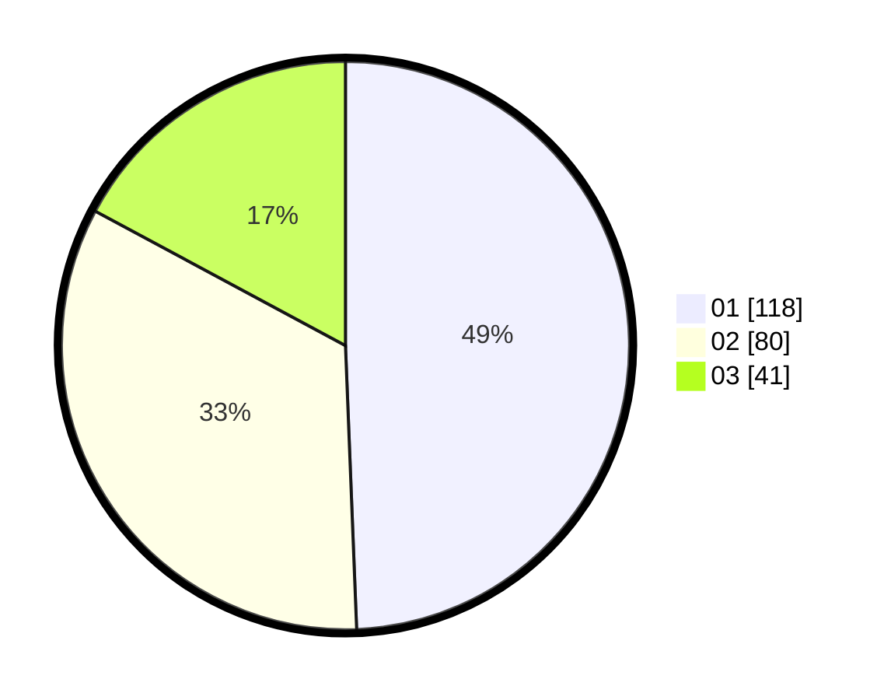

# Hasil

Hasil perolehan suara paslon dapat dilihat pada file paslon-01.txt, paslon-02.txt, dan paslon-03.txt.

Jika tidak ada, artinya data tersebut belum ada pada SIREKAP.

## Perolehan Suara

 * Paslon 01: **118**.
 * Paslon 02: **80**.
 * Paslon 03: **41**.

## Foto C Plano

https://sirekap-obj-formc.kpu.go.id/d443/pemilu/ppwp/31/73/07/10/01/3173071001173-20240215-015340--19d02c66-9d9a-4399-ad62-b7bb6e7cff3e.jpg

https://sirekap-obj-formc.kpu.go.id/d443/pemilu/ppwp/31/73/07/10/01/3173071001173-20240215-015435--1f901186-dbd1-4735-9a27-3cb414e91520.jpg

https://sirekap-obj-formc.kpu.go.id/d443/pemilu/ppwp/31/73/07/10/01/3173071001173-20240215-015419--719d5c46-0db1-4031-9660-1f00bb9f26ff.jpg

## DATA PEMILIH TETAP

Jumlah pemilih dalam DPT: **279**.
 * L: **128**.
 * P: **151**.

## DATA PENGGUNA HAK PILIH

Jumlah pengguna hak pilih dalam DPT: **235**.
 * L: **106**.
 * P: **129**.

Jumlah pengguna hak pilih dalam DPTb: **2**.
 * L: **1**.
 * P: **1**.

Jumlah pengguna hak pilih dalam DPK: **3**.
 * L: **1**.
 * P: **2**.

Jumlah pengguna hak pilih: **240**.
 * L: **108**.
 * P: **132**.

## JUMLAH SUARA SAH DAN TIDAK SAH

JUMLAH SELURUH SUARA SAH: **239**.

JUMLAH SUARA TIDAK SAH: **1**.

JUMLAH SELURUH SUARA SAH DAN SUARA TIDAK SAH: **240**.
