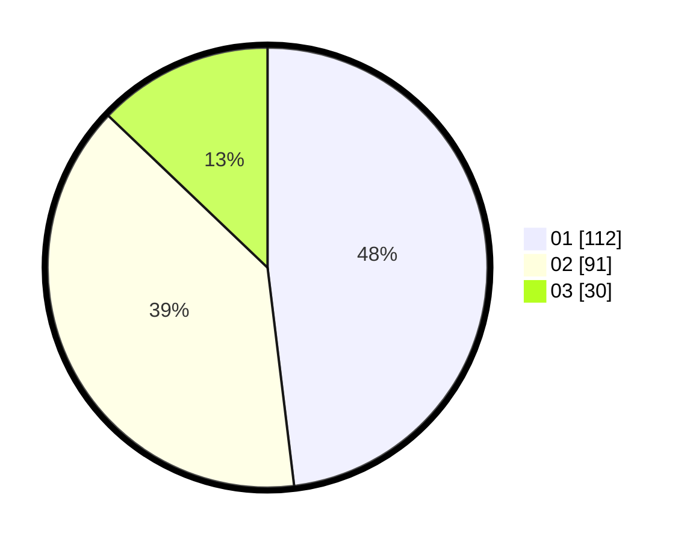

# Hasil

Hasil perolehan suara paslon dapat dilihat pada file paslon-01.txt, paslon-02.txt, dan paslon-03.txt.

Jika tidak ada, artinya data tersebut belum ada pada SIREKAP.

## Perolehan Suara

 * Paslon 01: **112**.
 * Paslon 02: **91**.
 * Paslon 03: **30**.

## Foto C Plano

https://sirekap-obj-formc.kpu.go.id/1fe4/pemilu/ppwp/31/73/07/10/01/3173071001178-20240214-225852--5118b595-b456-4b07-bd14-f74d65760ea0.jpg

https://sirekap-obj-formc.kpu.go.id/1fe4/pemilu/ppwp/31/73/07/10/01/3173071001178-20240214-230001--d530c49a-2b07-4409-90f8-4ee9b814fd84.jpg

https://sirekap-obj-formc.kpu.go.id/1fe4/pemilu/ppwp/31/73/07/10/01/3173071001178-20240214-230103--a832f426-401f-4cb6-8fee-00d942ccdaea.jpg
