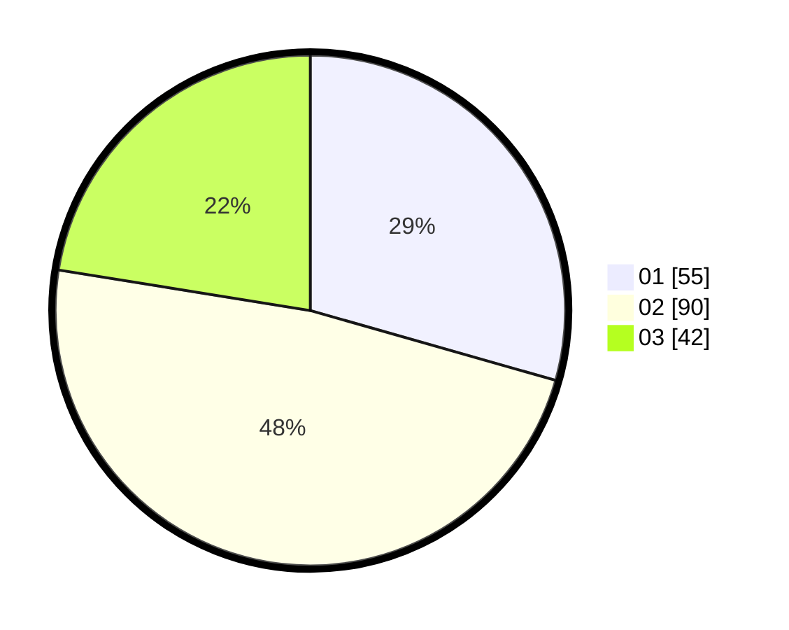

# Hasil

Hasil perolehan suara paslon dapat dilihat pada file paslon-01.txt, paslon-02.txt, dan paslon-03.txt.

Jika tidak ada, artinya data tersebut belum ada pada SIREKAP.

## Perolehan Suara

 * Paslon 01: **55**.
 * Paslon 02: **90**.
 * Paslon 03: **42**.

## Foto C Plano

https://sirekap-obj-formc.kpu.go.id/e43d/pemilu/ppwp/31/73/07/10/01/3173071001184-20240214-235416--3172fef5-0a11-4869-94ef-7f8b2bd70471.jpg

https://sirekap-obj-formc.kpu.go.id/e43d/pemilu/ppwp/31/73/07/10/01/3173071001184-20240214-215828--48bea4aa-c70f-421a-8f8a-24f2f2818779.jpg

https://sirekap-obj-formc.kpu.go.id/e43d/pemilu/ppwp/31/73/07/10/01/3173071001184-20240214-235634--bbdde072-dbc7-473b-ad71-add10e68ee83.jpg
