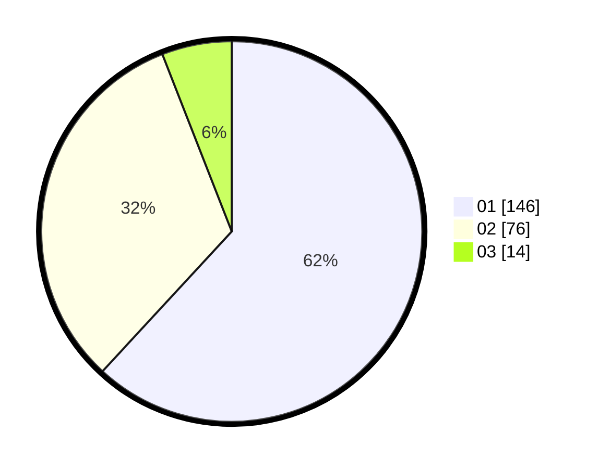

# Hasil

Hasil perolehan suara paslon dapat dilihat pada file paslon-01.txt, paslon-02.txt, dan paslon-03.txt.

Jika tidak ada, artinya data tersebut belum ada pada SIREKAP.

## Perolehan Suara

 * Paslon 01: **146**.
 * Paslon 02: **76**.
 * Paslon 03: **14**.

## Foto C Plano

https://sirekap-obj-formc.kpu.go.id/12cd/pemilu/ppwp/31/73/07/10/01/3173071001188-20240214-230154--16b97231-0f77-4abd-a114-16100b4bd6c7.jpg

https://sirekap-obj-formc.kpu.go.id/12cd/pemilu/ppwp/31/73/07/10/01/3173071001188-20240214-225432--6296010c-0122-40a8-b420-467ca2f2d56f.jpg

https://sirekap-obj-formc.kpu.go.id/12cd/pemilu/ppwp/31/73/07/10/01/3173071001188-20240214-225633--b4cb7370-a33e-4ab7-9def-8d911b24ec92.jpg
