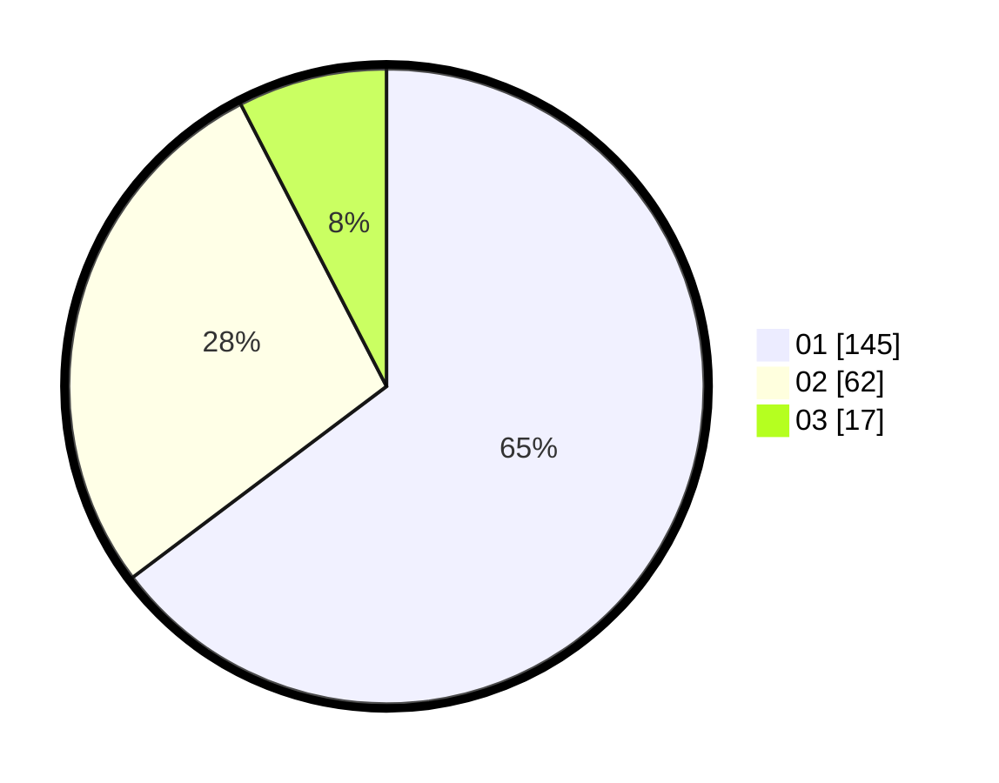

# Hasil

Hasil perolehan suara paslon dapat dilihat pada file paslon-01.txt, paslon-02.txt, dan paslon-03.txt.

Jika tidak ada, artinya data tersebut belum ada pada SIREKAP.

## Perolehan Suara

 * Paslon 01: **145**.
 * Paslon 02: **62**.
 * Paslon 03: **17**.

## Foto C Plano

https://sirekap-obj-formc.kpu.go.id/fb3f/pemilu/ppwp/31/73/07/10/01/3173071001189-20240215-092230--480e5011-1a01-4b1c-8803-f5640d87b7c4.jpg

https://sirekap-obj-formc.kpu.go.id/fb3f/pemilu/ppwp/31/73/07/10/01/3173071001189-20240215-054143--33a5b5bb-39ef-4332-93ec-b749e6642b72.jpg

https://sirekap-obj-formc.kpu.go.id/fb3f/pemilu/ppwp/31/73/07/10/01/3173071001189-20240215-092548--e59da718-6271-4ce8-b801-fb7627ff5890.jpg
