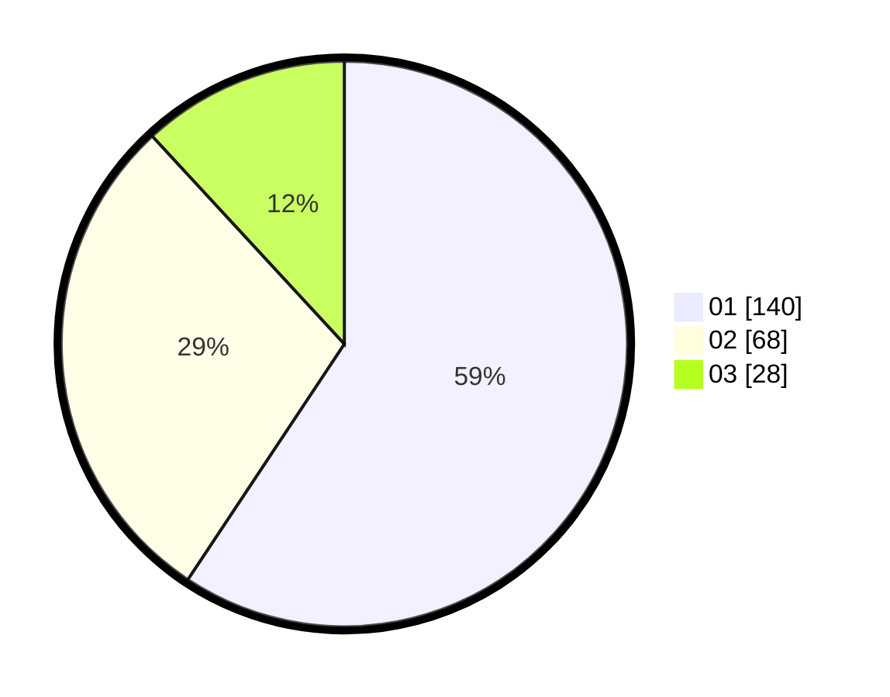

# Hasil

Hasil perolehan suara paslon dapat dilihat pada file paslon-01.txt, paslon-02.txt, dan paslon-03.txt.

Jika tidak ada, artinya data tersebut belum ada pada SIREKAP.

## Perolehan Suara

 * Paslon 01: **140**.
 * Paslon 02: **68**.
 * Paslon 03: **28**.

## Foto C Plano

https://sirekap-obj-formc.kpu.go.id/8d0d/pemilu/ppwp/31/73/07/10/01/3173071001190-20240215-054528--88b9d2dd-e89a-4ec9-8a2f-f92a8a96cc43.jpg

https://sirekap-obj-formc.kpu.go.id/8d0d/pemilu/ppwp/31/73/07/10/01/3173071001190-20240215-054559--35c8feb8-5ff0-4317-a5ae-644609e3f148.jpg

https://sirekap-obj-formc.kpu.go.id/8d0d/pemilu/ppwp/31/73/07/10/01/3173071001190-20240215-054624--b1611a8e-e2e3-4b7d-8b5a-255e2e6c0827.jpg
