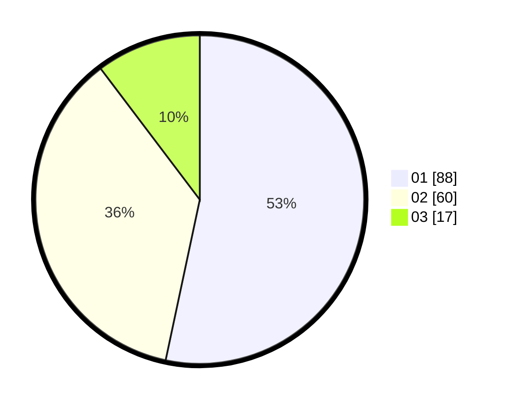

# Hasil

Hasil perolehan suara paslon dapat dilihat pada file paslon-01.txt, paslon-02.txt, dan paslon-03.txt.

Jika tidak ada, artinya data tersebut belum ada pada SIREKAP.

## Perolehan Suara

 * Paslon 01: **88**.
 * Paslon 02: **60**.
 * Paslon 03: **17**.

## Foto C Plano

https://sirekap-obj-formc.kpu.go.id/6b80/pemilu/ppwp/31/73/07/10/01/3173071001191-20240217-184459--b0abf5be-3c04-49c4-bf81-445614d663d7.jpg

https://sirekap-obj-formc.kpu.go.id/6b80/pemilu/ppwp/31/73/07/10/01/3173071001191-20240217-184636--6740f716-ec41-4c97-9993-957b0a0ad98b.jpg
