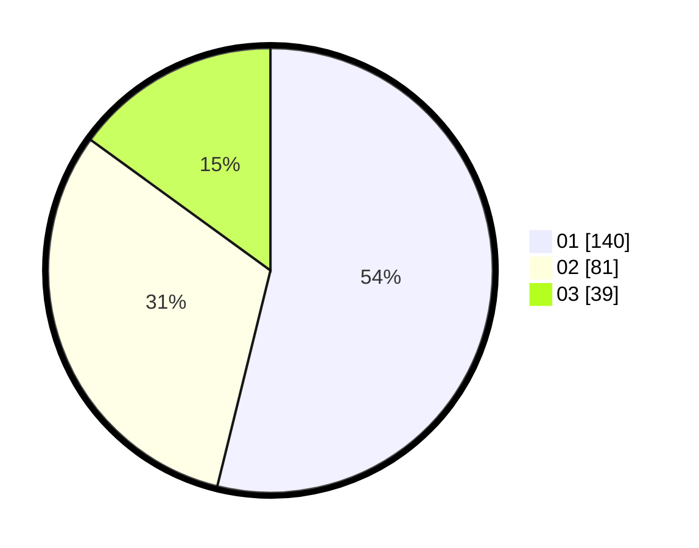

# Hasil

Hasil perolehan suara paslon dapat dilihat pada file paslon-01.txt, paslon-02.txt, dan paslon-03.txt.

Jika tidak ada, artinya data tersebut belum ada pada SIREKAP.

## Perolehan Suara

 * Paslon 01: **140**.
 * Paslon 02: **81**.
 * Paslon 03: **39**.

## Foto C Plano

https://sirekap-obj-formc.kpu.go.id/dfd4/pemilu/ppwp/31/73/07/10/01/3173071001192-20240214-234717--aab5630f-8303-470e-a7db-aa3823b28f79.jpg

https://sirekap-obj-formc.kpu.go.id/dfd4/pemilu/ppwp/31/73/07/10/01/3173071001192-20240214-235019--401c195d-f18c-455c-ba9a-8be85290d16e.jpg

https://sirekap-obj-formc.kpu.go.id/dfd4/pemilu/ppwp/31/73/07/10/01/3173071001192-20240214-235148--714f6e54-2347-4c2e-8c60-b070bc5f5d71.jpg
