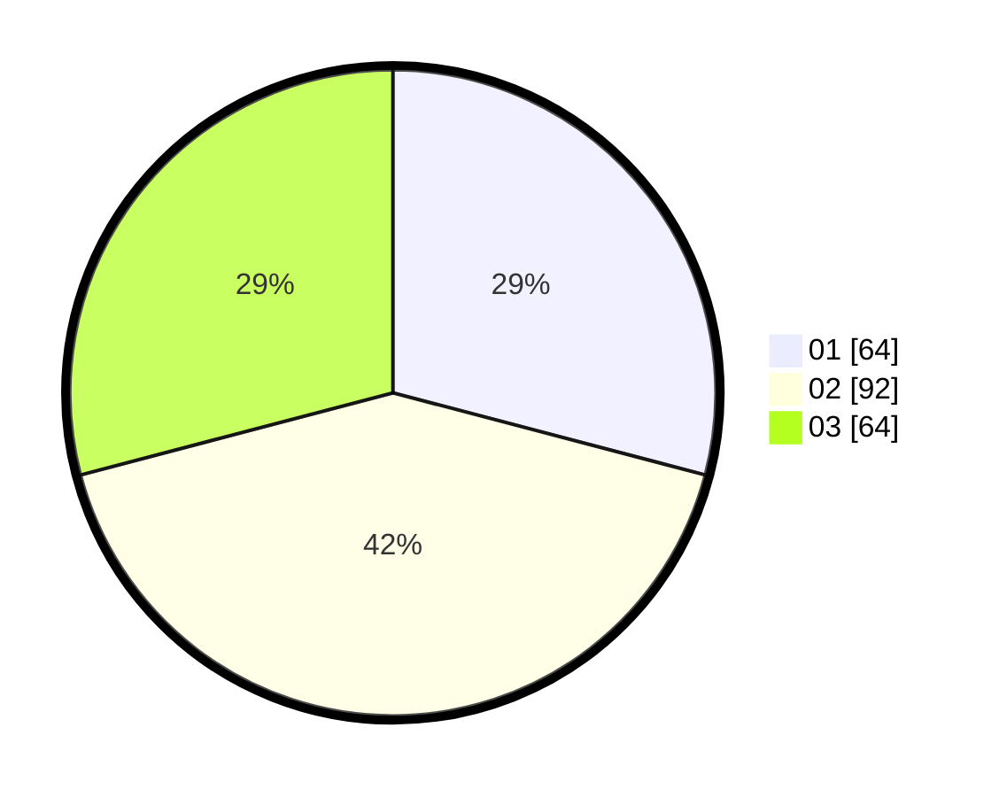

# Hasil

Hasil perolehan suara paslon dapat dilihat pada file paslon-01.txt, paslon-02.txt, dan paslon-03.txt.

Jika tidak ada, artinya data tersebut belum ada pada SIREKAP.

## Perolehan Suara

 * Paslon 01: **64**.
 * Paslon 02: **92**.
 * Paslon 03: **64**.

## Foto C Plano

https://sirekap-obj-formc.kpu.go.id/b503/pemilu/ppwp/31/73/07/10/01/3173071001194-20240214-215905--64e491b3-0eed-4963-9258-67b10314ddb8.jpg

https://sirekap-obj-formc.kpu.go.id/b503/pemilu/ppwp/31/73/07/10/01/3173071001194-20240214-212558--48c1d29d-ddf0-4b45-adc1-7367b491cedd.jpg

https://sirekap-obj-formc.kpu.go.id/b503/pemilu/ppwp/31/73/07/10/01/3173071001194-20240214-155707--0c7528a4-bae6-4952-a1b5-bd268c5d104a.jpg
