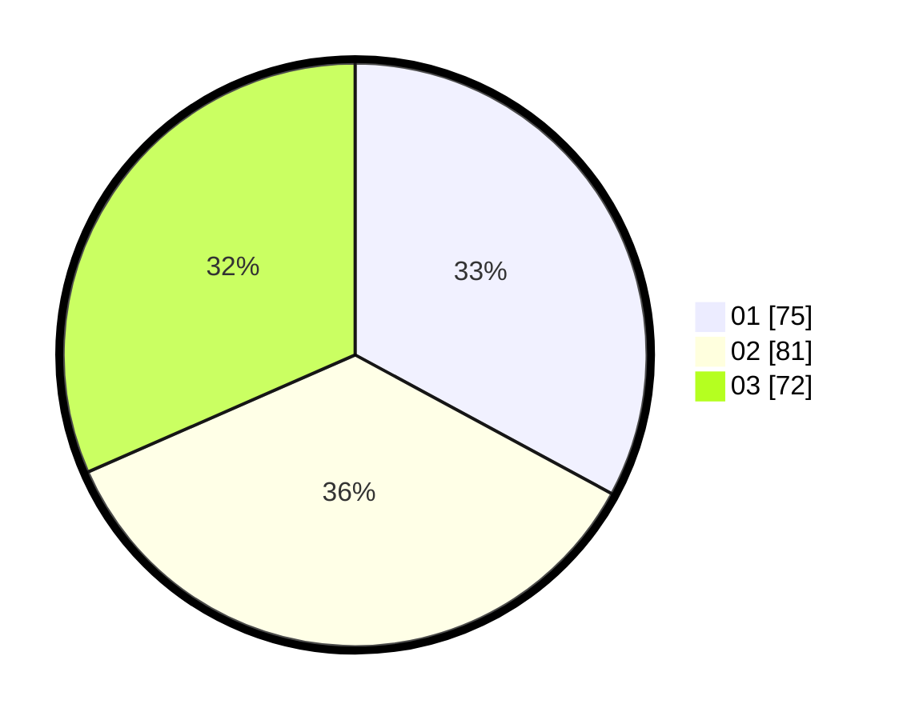

# Hasil

Hasil perolehan suara paslon dapat dilihat pada file paslon-01.txt, paslon-02.txt, dan paslon-03.txt.

Jika tidak ada, artinya data tersebut belum ada pada SIREKAP.

## Perolehan Suara

 * Paslon 01: **75**.
 * Paslon 02: **81**.
 * Paslon 03: **72**.

## Foto C Plano

https://sirekap-obj-formc.kpu.go.id/4ba5/pemilu/ppwp/31/73/07/10/01/3173071001198-20240214-185205--d1f7f6db-3393-402e-8702-70c5d4421831.jpg

https://sirekap-obj-formc.kpu.go.id/4ba5/pemilu/ppwp/31/73/07/10/01/3173071001198-20240214-211459--e8500b9c-b2bc-428b-a5db-6f22fc9d78ac.jpg

https://sirekap-obj-formc.kpu.go.id/4ba5/pemilu/ppwp/31/73/07/10/01/3173071001198-20240214-211610--48cc405d-0d28-4cb4-8d37-1d8c1e32c8cb.jpg

## DATA PEMILIH TETAP

Jumlah pemilih dalam DPT: **280**.
 * L: **135**.
 * P: **145**.

## DATA PENGGUNA HAK PILIH

Jumlah pengguna hak pilih dalam DPT: **223**.
 * L: **103**.
 * P: **120**.

Jumlah pengguna hak pilih dalam DPTb: **3**.
 * L: **1**.
 * P: **2**.

Jumlah pengguna hak pilih dalam DPK: **3**.
 * L: **1**.
 * P: **2**.

Jumlah pengguna hak pilih: **229**.
 * L: **105**.
 * P: **124**.

## JUMLAH SUARA SAH DAN TIDAK SAH

JUMLAH SELURUH SUARA SAH: **228**.

JUMLAH SUARA TIDAK SAH: **1**.

JUMLAH SELURUH SUARA SAH DAN SUARA TIDAK SAH: **229**.
