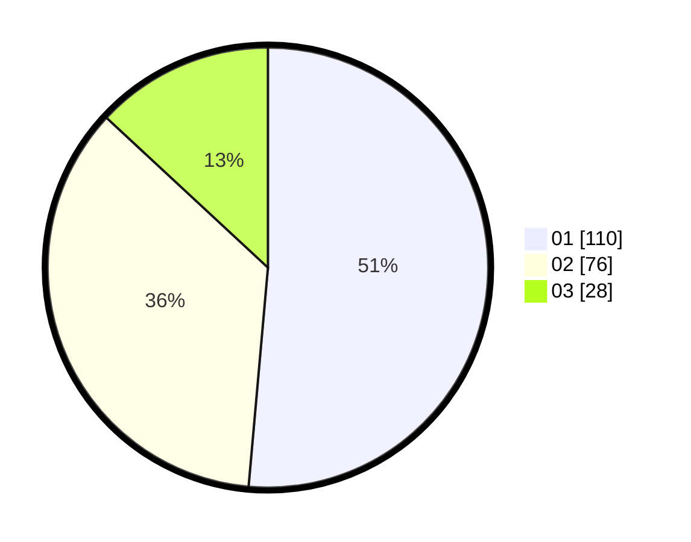

# Hasil

Hasil perolehan suara paslon dapat dilihat pada file paslon-01.txt, paslon-02.txt, dan paslon-03.txt.

Jika tidak ada, artinya data tersebut belum ada pada SIREKAP.

## Perolehan Suara

 * Paslon 01: **110**.
 * Paslon 02: **76**.
 * Paslon 03: **28**.

## Foto C Plano

https://sirekap-obj-formc.kpu.go.id/d2c5/pemilu/ppwp/31/73/07/10/01/3173071001200-20240215-002635--87b20555-346e-475b-a797-18801c152dc5.jpg

https://sirekap-obj-formc.kpu.go.id/d2c5/pemilu/ppwp/31/73/07/10/01/3173071001200-20240215-002642--08f1c4e2-7a99-4d82-975b-10ec07ddabfb.jpg

https://sirekap-obj-formc.kpu.go.id/d2c5/pemilu/ppwp/31/73/07/10/01/3173071001200-20240215-002650--678e5973-d032-4c1e-8372-691e3eddd03e.jpg
