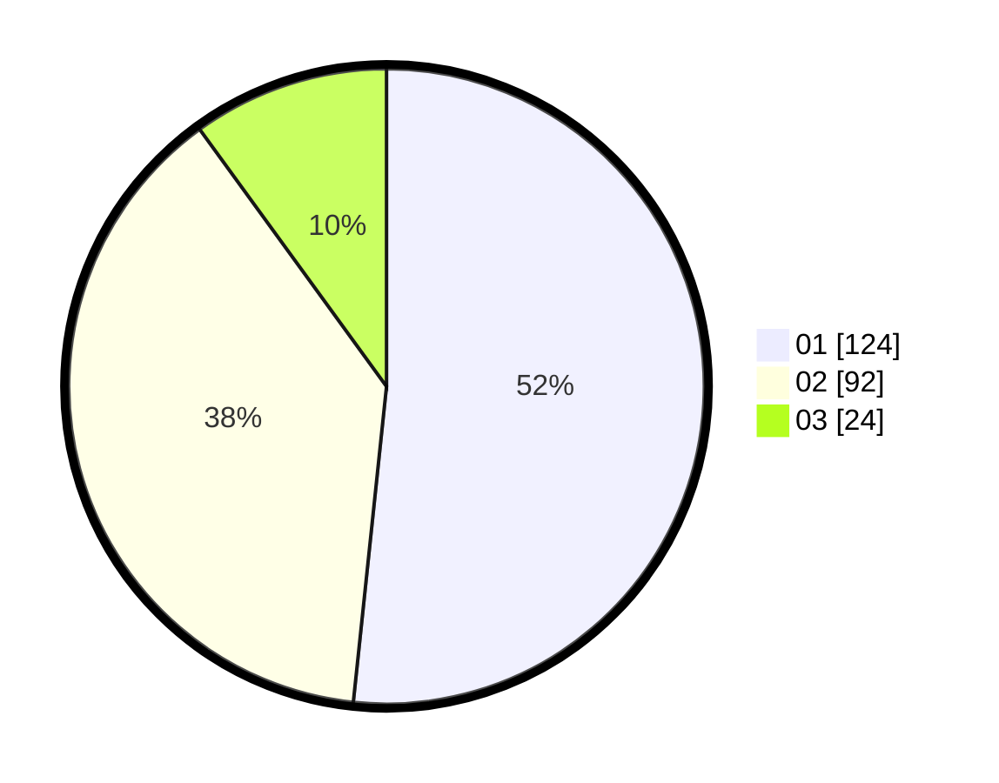

# Hasil

Hasil perolehan suara paslon dapat dilihat pada file paslon-01.txt, paslon-02.txt, dan paslon-03.txt.

Jika tidak ada, artinya data tersebut belum ada pada SIREKAP.

## Perolehan Suara

 * Paslon 01: **124**.
 * Paslon 02: **92**.
 * Paslon 03: **24**.

## Foto C Plano

https://sirekap-obj-formc.kpu.go.id/61fe/pemilu/ppwp/31/73/07/10/01/3173071001205-20240214-155413--939bd891-bb97-4fd8-8380-0257b6bdac22.jpg

https://sirekap-obj-formc.kpu.go.id/61fe/pemilu/ppwp/31/73/07/10/01/3173071001205-20240214-155040--2b2e91e0-2a5a-4748-aa75-3b677ff95697.jpg

https://sirekap-obj-formc.kpu.go.id/61fe/pemilu/ppwp/31/73/07/10/01/3173071001205-20240214-155744--eaefa8cd-e762-4166-8c55-dafdd3ce26f9.jpg

## DATA PEMILIH TETAP

Jumlah pemilih dalam DPT: **281**.
 * L: **156**.
 * P: **125**.

## DATA PENGGUNA HAK PILIH

Jumlah pengguna hak pilih dalam DPT: **243**.
 * L: **134**.
 * P: **109**.

Jumlah pengguna hak pilih dalam DPTb: **0**.
 * L: **0**.
 * P: **0**.

Jumlah pengguna hak pilih dalam DPK: **0**.
 * L: **0**.
 * P: **0**.

Jumlah pengguna hak pilih: **243**.
 * L: **134**.
 * P: **109**.

## JUMLAH SUARA SAH DAN TIDAK SAH

JUMLAH SELURUH SUARA SAH: **240**.

JUMLAH SUARA TIDAK SAH: **3**.

JUMLAH SELURUH SUARA SAH DAN SUARA TIDAK SAH: **243**.
