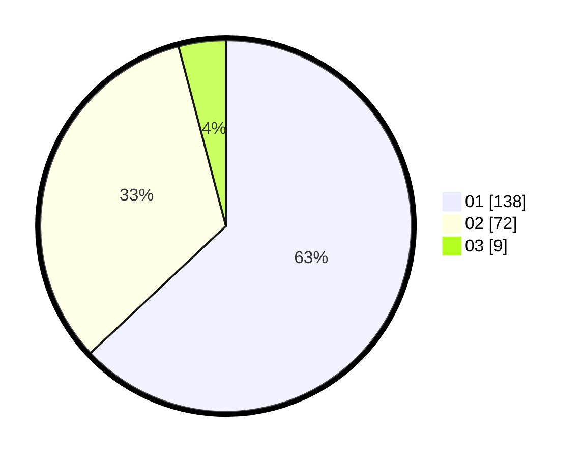

# Hasil

Hasil perolehan suara paslon dapat dilihat pada file paslon-01.txt, paslon-02.txt, dan paslon-03.txt.

Jika tidak ada, artinya data tersebut belum ada pada SIREKAP.

## Perolehan Suara

 * Paslon 01: **138**.
 * Paslon 02: **72**.
 * Paslon 03: **9**.

## Foto C Plano

https://sirekap-obj-formc.kpu.go.id/3e56/pemilu/ppwp/31/73/07/10/01/3173071001207-20240214-225501--fc6bb54b-34d9-42a9-8ade-7d716bb9f1f6.jpg

https://sirekap-obj-formc.kpu.go.id/3e56/pemilu/ppwp/31/73/07/10/01/3173071001207-20240214-230842--c1b43225-cb75-4f57-824a-cae07ca2e63c.jpg

https://sirekap-obj-formc.kpu.go.id/3e56/pemilu/ppwp/31/73/07/10/01/3173071001207-20240214-230050--43107eb9-f18e-40aa-99c4-90dd6625b5c4.jpg
