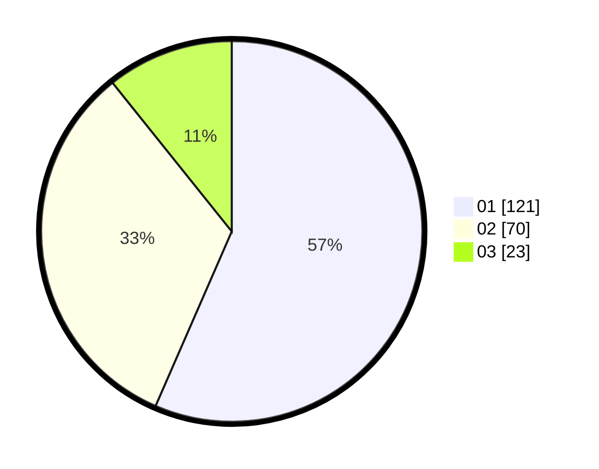

# Hasil

Hasil perolehan suara paslon dapat dilihat pada file paslon-01.txt, paslon-02.txt, dan paslon-03.txt.

Jika tidak ada, artinya data tersebut belum ada pada SIREKAP.

## Perolehan Suara

 * Paslon 01: **121**.
 * Paslon 02: **70**.
 * Paslon 03: **23**.

## Foto C Plano

https://sirekap-obj-formc.kpu.go.id/598e/pemilu/ppwp/31/73/07/10/01/3173071001209-20240217-092023--29ba68c2-246c-4254-b06f-0652a4f29186.jpg

https://sirekap-obj-formc.kpu.go.id/598e/pemilu/ppwp/31/73/07/10/01/3173071001209-20240214-223938--2e2bfb21-e58c-46c9-b86f-97bf64d29cd1.jpg

https://sirekap-obj-formc.kpu.go.id/598e/pemilu/ppwp/31/73/07/10/01/3173071001209-20240214-224103--e82e36cc-8af9-4426-885b-38a0d8e434b1.jpg

## DATA PEMILIH TETAP

Jumlah pemilih dalam DPT: **275**.
 * L: **135**.
 * P: **140**.

## DATA PENGGUNA HAK PILIH

Jumlah pengguna hak pilih dalam DPT: **197**.
 * L: **88**.
 * P: **109**.

Jumlah pengguna hak pilih dalam DPTb: **16**.
 * L: **9**.
 * P: **7**.

Jumlah pengguna hak pilih dalam DPK: **4**.
 * L: **3**.
 * P: **1**.

Jumlah pengguna hak pilih: **217**.
 * L: **100**.
 * P: **117**.

## JUMLAH SUARA SAH DAN TIDAK SAH

JUMLAH SELURUH SUARA SAH: **214**.

JUMLAH SUARA TIDAK SAH: **3**.

JUMLAH SELURUH SUARA SAH DAN SUARA TIDAK SAH: **217**.
