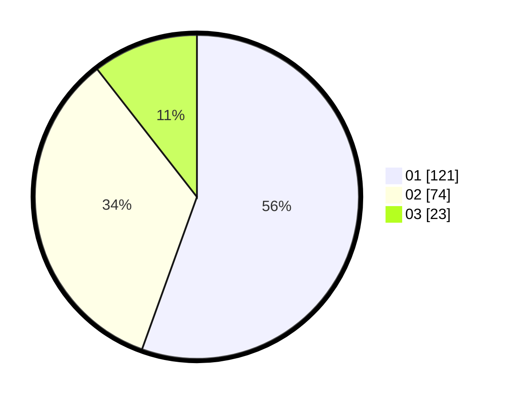

# Hasil

Hasil perolehan suara paslon dapat dilihat pada file paslon-01.txt, paslon-02.txt, dan paslon-03.txt.

Jika tidak ada, artinya data tersebut belum ada pada SIREKAP.

## Perolehan Suara

 * Paslon 01: **121**.
 * Paslon 02: **74**.
 * Paslon 03: **23**.

## Foto C Plano

https://sirekap-obj-formc.kpu.go.id/b26d/pemilu/ppwp/31/73/07/10/01/3173071001211-20240215-033622--1a00ee9b-b2c9-41aa-8a11-28973038b563.jpg

https://sirekap-obj-formc.kpu.go.id/b26d/pemilu/ppwp/31/73/07/10/01/3173071001211-20240214-155131--93c4be22-f59c-4fe6-a733-40bf7d8ac850.jpg

https://sirekap-obj-formc.kpu.go.id/b26d/pemilu/ppwp/31/73/07/10/01/3173071001211-20240214-155230--4752922a-c1d9-4824-afcd-54e483f438e9.jpg
