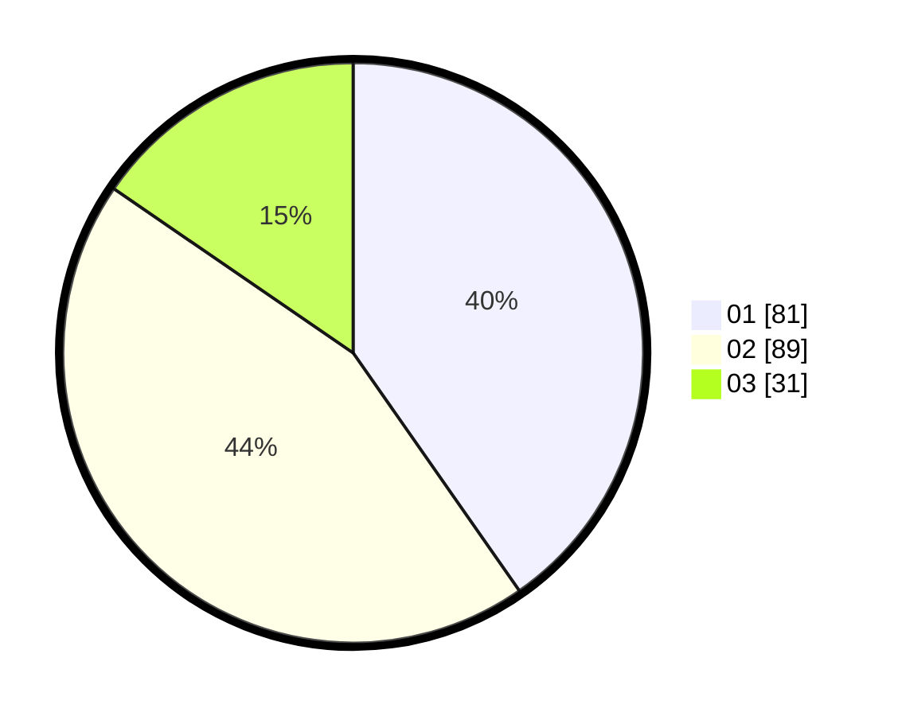

# Hasil

Hasil perolehan suara paslon dapat dilihat pada file paslon-01.txt, paslon-02.txt, dan paslon-03.txt.

Jika tidak ada, artinya data tersebut belum ada pada SIREKAP.

## Perolehan Suara

 * Paslon 01: **81**.
 * Paslon 02: **89**.
 * Paslon 03: **31**.

## Foto C Plano

https://sirekap-obj-formc.kpu.go.id/a6b3/pemilu/ppwp/31/73/07/10/01/3173071001213-20240214-231741--9ebf91ba-3175-4a10-a8fa-d4e1600b46d8.jpg

https://sirekap-obj-formc.kpu.go.id/a6b3/pemilu/ppwp/31/73/07/10/01/3173071001213-20240214-232310--35554932-fc6b-48ea-be4b-f3f136b5d984.jpg

https://sirekap-obj-formc.kpu.go.id/a6b3/pemilu/ppwp/31/73/07/10/01/3173071001213-20240214-232447--bf221c70-c8fc-42d7-a28a-6ded0a670ac6.jpg

## DATA PEMILIH TETAP

Jumlah pemilih dalam DPT: **280**.
 * L: **140**.
 * P: **140**.

## DATA PENGGUNA HAK PILIH

Jumlah pengguna hak pilih dalam DPT: **208**.
 * L: **101**.
 * P: **107**.

Jumlah pengguna hak pilih dalam DPTb: **0**.
 * L: **0**.
 * P: **0**.

Jumlah pengguna hak pilih dalam DPK: **0**.
 * L: **0**.
 * P: **0**.

Jumlah pengguna hak pilih: **208**.
 * L: **101**.
 * P: **107**.

## JUMLAH SUARA SAH DAN TIDAK SAH

JUMLAH SELURUH SUARA SAH: **201**.

JUMLAH SUARA TIDAK SAH: **7**.

JUMLAH SELURUH SUARA SAH DAN SUARA TIDAK SAH: **208**.
