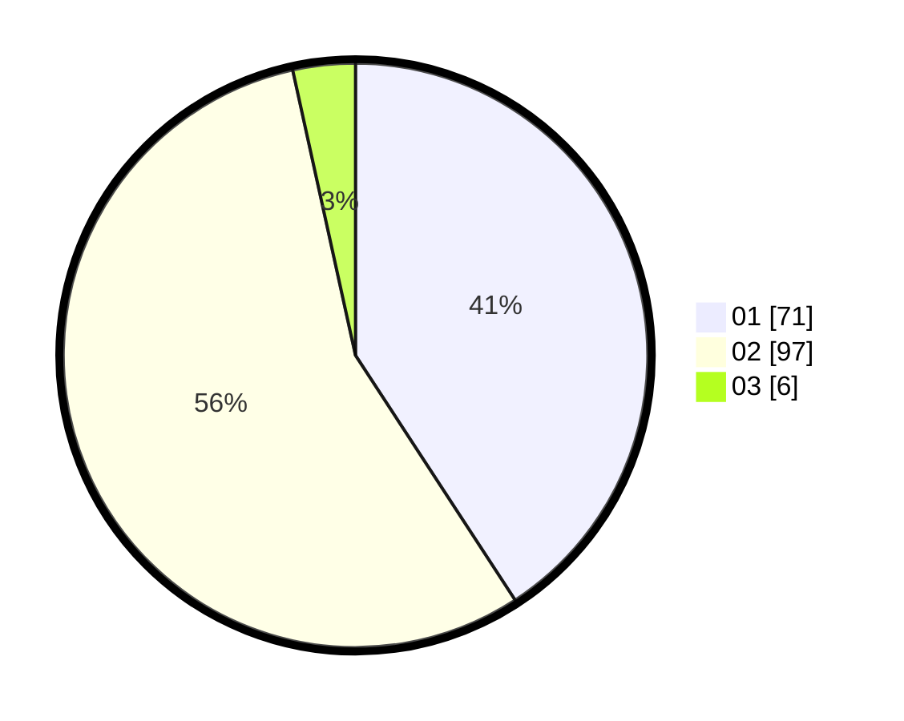

# Hasil

Hasil perolehan suara paslon dapat dilihat pada file paslon-01.txt, paslon-02.txt, dan paslon-03.txt.

Jika tidak ada, artinya data tersebut belum ada pada SIREKAP.

## Perolehan Suara

 * Paslon 01: **71**.
 * Paslon 02: **97**.
 * Paslon 03: **6**.

## Foto C Plano

https://sirekap-obj-formc.kpu.go.id/624d/pemilu/ppwp/31/73/07/10/01/3173071001214-20240214-212207--8cf855fc-94ea-4432-9598-c1a7367500f6.jpg

https://sirekap-obj-formc.kpu.go.id/624d/pemilu/ppwp/31/73/07/10/01/3173071001214-20240214-212558--6bd901ab-ceb6-45a1-a0b9-5eab731f33af.jpg

https://sirekap-obj-formc.kpu.go.id/624d/pemilu/ppwp/31/73/07/10/01/3173071001214-20240214-212917--f092c223-fb9f-4677-a433-8afca6cd32c7.jpg
