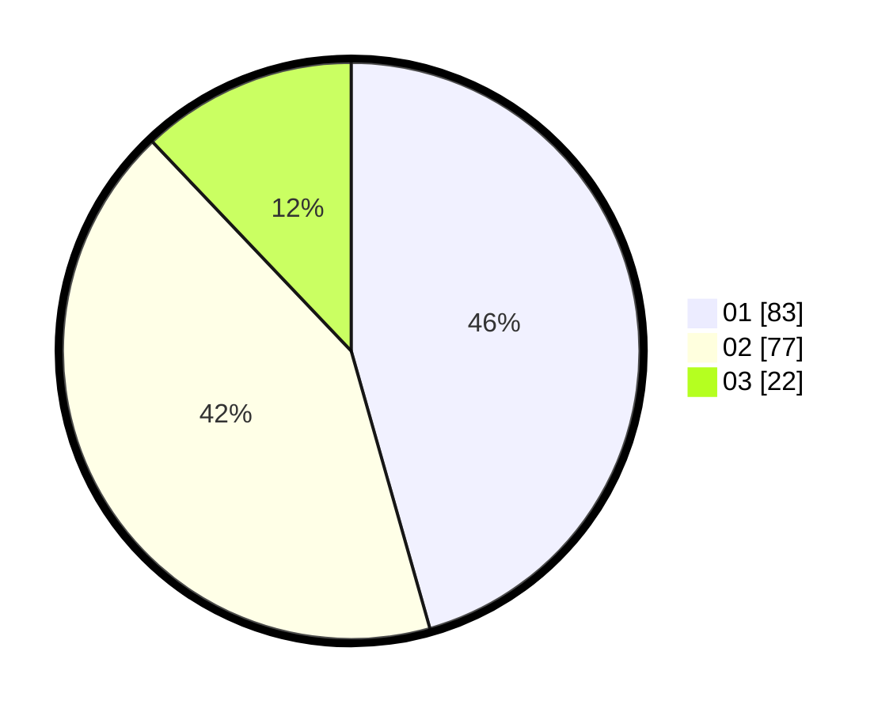

# Hasil

Hasil perolehan suara paslon dapat dilihat pada file paslon-01.txt, paslon-02.txt, dan paslon-03.txt.

Jika tidak ada, artinya data tersebut belum ada pada SIREKAP.

## Perolehan Suara

 * Paslon 01: **83**.
 * Paslon 02: **77**.
 * Paslon 03: **22**.

## Foto C Plano

https://sirekap-obj-formc.kpu.go.id/5ec6/pemilu/ppwp/31/73/07/10/01/3173071001217-20240214-224811--18f5145d-7110-405f-9b50-ef47d89fc0eb.jpg

https://sirekap-obj-formc.kpu.go.id/5ec6/pemilu/ppwp/31/73/07/10/01/3173071001217-20240214-224923--c7603ccc-fb90-43a4-b62d-caff2368d493.jpg

https://sirekap-obj-formc.kpu.go.id/5ec6/pemilu/ppwp/31/73/07/10/01/3173071001217-20240214-221229--2a768f82-5396-471f-9e91-0d8689377762.jpg
