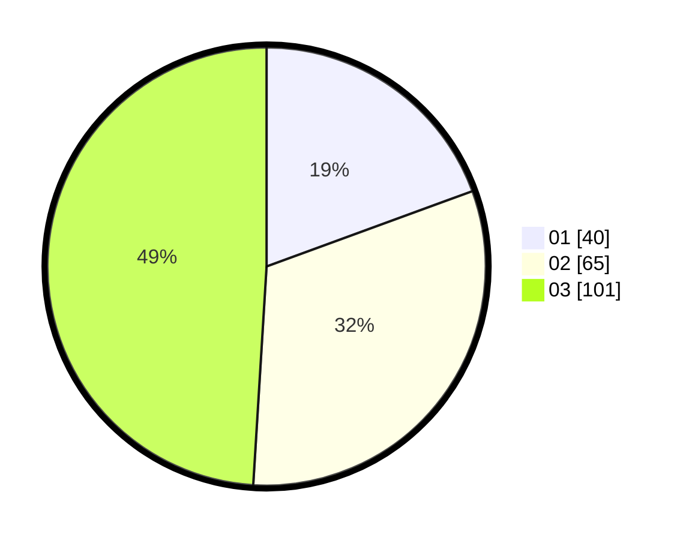

# Hasil

Hasil perolehan suara paslon dapat dilihat pada file paslon-01.txt, paslon-02.txt, dan paslon-03.txt.

Jika tidak ada, artinya data tersebut belum ada pada SIREKAP.

## Perolehan Suara

 * Paslon 01: **40**.
 * Paslon 02: **65**.
 * Paslon 03: **101**.

## Foto C Plano

https://sirekap-obj-formc.kpu.go.id/cd2a/pemilu/ppwp/31/73/07/10/02/3173071002001-20240214-210951--3d63a936-e0ea-4ea5-8dbc-f905913c6e17.jpg

https://sirekap-obj-formc.kpu.go.id/cd2a/pemilu/ppwp/31/73/07/10/02/3173071002001-20240214-211100--9a3ad6c5-7dfa-49f6-a3ed-a69fd594c704.jpg

https://sirekap-obj-formc.kpu.go.id/cd2a/pemilu/ppwp/31/73/07/10/02/3173071002001-20240214-211146--b3322c18-3180-4c95-921c-fce0d468004c.jpg
