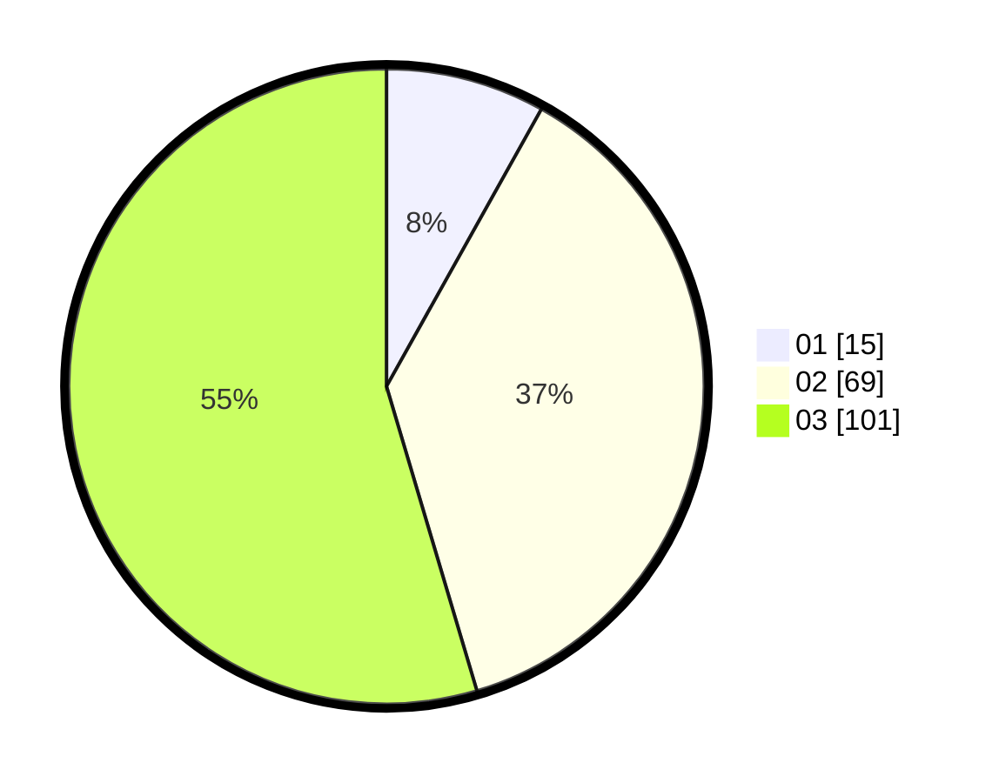

# Hasil

Hasil perolehan suara paslon dapat dilihat pada file paslon-01.txt, paslon-02.txt, dan paslon-03.txt.

Jika tidak ada, artinya data tersebut belum ada pada SIREKAP.

## Perolehan Suara

 * Paslon 01: **15**.
 * Paslon 02: **69**.
 * Paslon 03: **101**.

## Foto C Plano

https://sirekap-obj-formc.kpu.go.id/6501/pemilu/ppwp/31/73/07/10/02/3173071002002-20240216-135147--c5e8ac99-18e6-477e-8dda-8e7e4c7954d2.jpg

https://sirekap-obj-formc.kpu.go.id/6501/pemilu/ppwp/31/73/07/10/02/3173071002002-20240216-135148--91808a27-b658-4b4a-b634-b83de817cccc.jpg

https://sirekap-obj-formc.kpu.go.id/6501/pemilu/ppwp/31/73/07/10/02/3173071002002-20240216-135147--88ed9d69-998a-488d-8158-a6f6cb727fa8.jpg

## DATA PEMILIH TETAP

Jumlah pemilih dalam DPT: **240**.
 * L: **119**.
 * P: **121**.

## DATA PENGGUNA HAK PILIH

Jumlah pengguna hak pilih dalam DPT: **166**.
 * L: **85**.
 * P: **81**.

Jumlah pengguna hak pilih dalam DPTb: **14**.
 * L: **6**.
 * P: **8**.

Jumlah pengguna hak pilih dalam DPK: **6**.
 * L: **5**.
 * P: **1**.

Jumlah pengguna hak pilih: **186**.
 * L: **96**.
 * P: **90**.

## JUMLAH SUARA SAH DAN TIDAK SAH

JUMLAH SELURUH SUARA SAH: **185**.

JUMLAH SUARA TIDAK SAH: **1**.

JUMLAH SELURUH SUARA SAH DAN SUARA TIDAK SAH: **186**.
