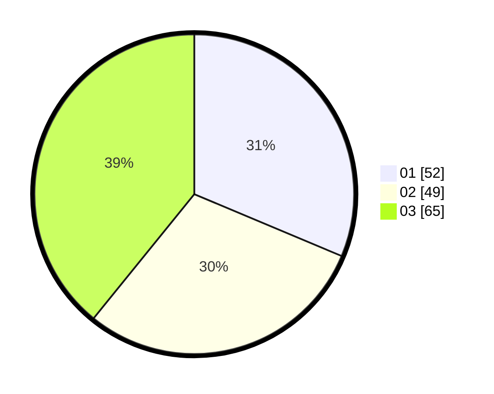

# Hasil

Hasil perolehan suara paslon dapat dilihat pada file paslon-01.txt, paslon-02.txt, dan paslon-03.txt.

Jika tidak ada, artinya data tersebut belum ada pada SIREKAP.

## Perolehan Suara

 * Paslon 01: **52**.
 * Paslon 02: **49**.
 * Paslon 03: **65**.

## Foto C Plano

https://sirekap-obj-formc.kpu.go.id/6240/pemilu/ppwp/31/73/07/10/02/3173071002003-20240215-014359--0cd5a941-d590-41a2-b038-0c56b2053542.jpg

https://sirekap-obj-formc.kpu.go.id/6240/pemilu/ppwp/31/73/07/10/02/3173071002003-20240215-014416--446a6aaf-3c7d-4cac-b9c5-ee45bb61b937.jpg

https://sirekap-obj-formc.kpu.go.id/6240/pemilu/ppwp/31/73/07/10/02/3173071002003-20240215-014522--2072444a-52c1-48a6-9002-bb1813bd7778.jpg

## DATA PEMILIH TETAP

Jumlah pemilih dalam DPT: **271**.
 * L: **135**.
 * P: **136**.

## DATA PENGGUNA HAK PILIH

Jumlah pengguna hak pilih dalam DPT: **203**.
 * L: **97**.
 * P: **106**.

Jumlah pengguna hak pilih dalam DPTb: **13**.
 * L: **504**.
 * P: **209**.

Jumlah pengguna hak pilih dalam DPK: **5**.
 * L: **2**.
 * P: **3**.

Jumlah pengguna hak pilih: **221**.
 * L: **103**.
 * P: **118**.

## JUMLAH SUARA SAH DAN TIDAK SAH

JUMLAH SELURUH SUARA SAH: **216**.

JUMLAH SUARA TIDAK SAH: **5**.

JUMLAH SELURUH SUARA SAH DAN SUARA TIDAK SAH: **221**.
