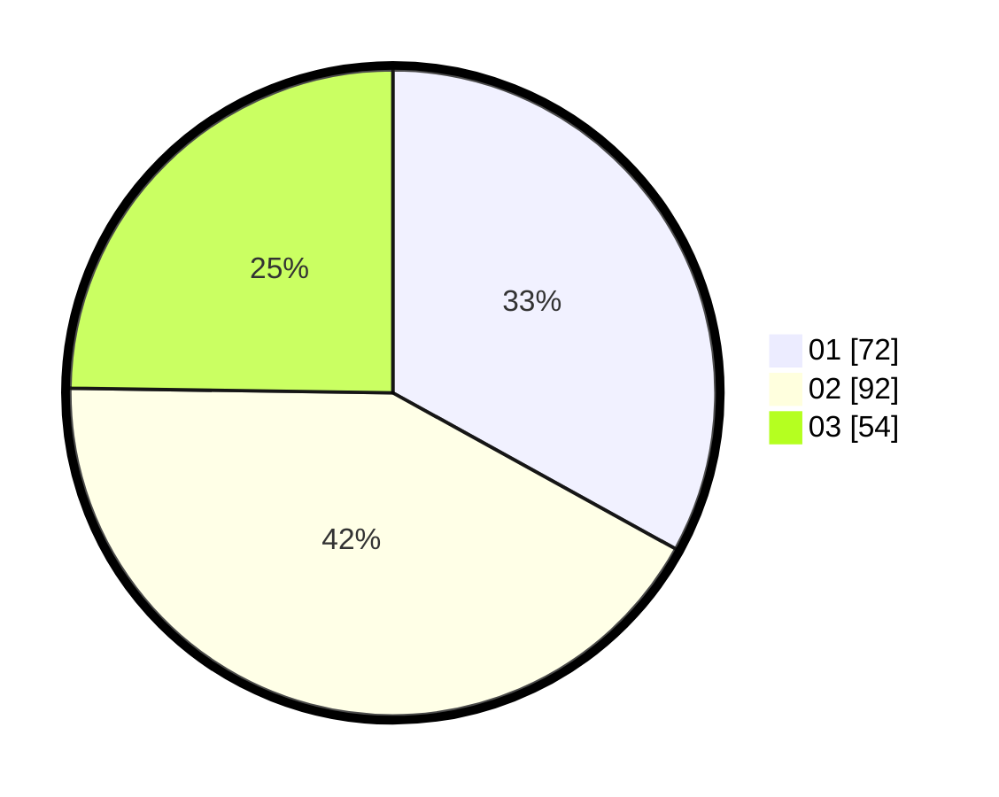

# Hasil

Hasil perolehan suara paslon dapat dilihat pada file paslon-01.txt, paslon-02.txt, dan paslon-03.txt.

Jika tidak ada, artinya data tersebut belum ada pada SIREKAP.

## Perolehan Suara

 * Paslon 01: **72**.
 * Paslon 02: **92**.
 * Paslon 03: **54**.

## Foto C Plano

https://sirekap-obj-formc.kpu.go.id/ce9d/pemilu/ppwp/31/73/07/10/02/3173071002004-20240214-155635--16e7b6ec-3fa9-47dc-86e9-f3b31befeeb8.jpg

https://sirekap-obj-formc.kpu.go.id/ce9d/pemilu/ppwp/31/73/07/10/02/3173071002004-20240214-155614--2fdb8668-da8a-41f4-85c7-b6b02c456595.jpg

https://sirekap-obj-formc.kpu.go.id/ce9d/pemilu/ppwp/31/73/07/10/02/3173071002004-20240216-100228--879e00b4-e66e-4218-bd33-eb2a8020ed67.jpg

## DATA PEMILIH TETAP

Jumlah pemilih dalam DPT: **268**.
 * L: **139**.
 * P: **129**.

## DATA PENGGUNA HAK PILIH

Jumlah pengguna hak pilih dalam DPT: **209**.
 * L: **108**.
 * P: **101**.

Jumlah pengguna hak pilih dalam DPTb: **12**.
 * L: **3**.
 * P: **9**.

Jumlah pengguna hak pilih dalam DPK: **0**.
 * L: **0**.
 * P: **0**.

Jumlah pengguna hak pilih: **221**.
 * L: **111**.
 * P: **110**.

## JUMLAH SUARA SAH DAN TIDAK SAH

JUMLAH SELURUH SUARA SAH: **218**.

JUMLAH SUARA TIDAK SAH: **3**.

JUMLAH SELURUH SUARA SAH DAN SUARA TIDAK SAH: **221**.
