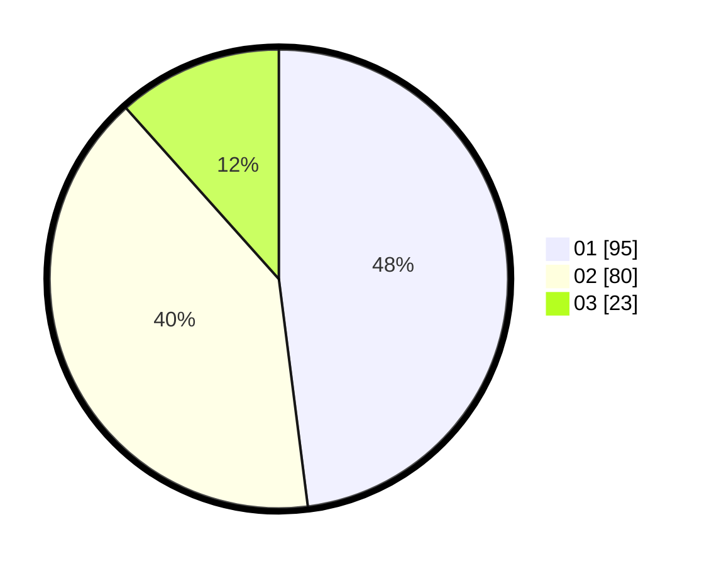

# Hasil

Hasil perolehan suara paslon dapat dilihat pada file paslon-01.txt, paslon-02.txt, dan paslon-03.txt.

Jika tidak ada, artinya data tersebut belum ada pada SIREKAP.

## Perolehan Suara

 * Paslon 01: **95**.
 * Paslon 02: **80**.
 * Paslon 03: **23**.

## Foto C Plano

https://sirekap-obj-formc.kpu.go.id/313b/pemilu/ppwp/31/73/07/10/02/3173071002006-20240216-134433--7d44350e-7428-4814-82bf-123f39717497.jpg

https://sirekap-obj-formc.kpu.go.id/313b/pemilu/ppwp/31/73/07/10/02/3173071002006-20240216-134434--5efc8a7e-a0d7-46ee-95a7-a6d22250bf64.jpg

https://sirekap-obj-formc.kpu.go.id/313b/pemilu/ppwp/31/73/07/10/02/3173071002006-20240216-134434--f9ff1c26-d88e-492c-b3cb-fb99873849c6.jpg

## DATA PEMILIH TETAP

Jumlah pemilih dalam DPT: **243**.
 * L: **124**.
 * P: **119**.

## DATA PENGGUNA HAK PILIH

Jumlah pengguna hak pilih dalam DPT: **190**.
 * L: **93**.
 * P: **97**.

Jumlah pengguna hak pilih dalam DPTb: **10**.
 * L: **5**.
 * P: **5**.

Jumlah pengguna hak pilih dalam DPK: **1**.
 * L: **0**.
 * P: **1**.

Jumlah pengguna hak pilih: **201**.
 * L: **98**.
 * P: **103**.

## JUMLAH SUARA SAH DAN TIDAK SAH

JUMLAH SELURUH SUARA SAH: **198**.

JUMLAH SUARA TIDAK SAH: **3**.

JUMLAH SELURUH SUARA SAH DAN SUARA TIDAK SAH: **201**.
