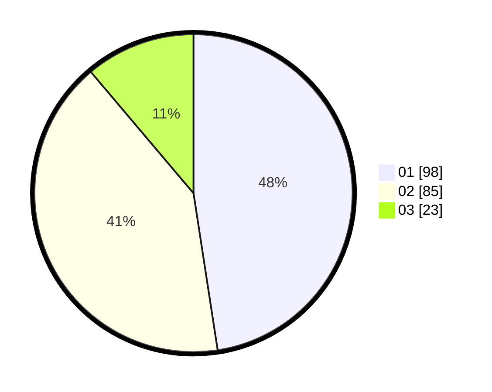

# Hasil

Hasil perolehan suara paslon dapat dilihat pada file paslon-01.txt, paslon-02.txt, dan paslon-03.txt.

Jika tidak ada, artinya data tersebut belum ada pada SIREKAP.

## Perolehan Suara

 * Paslon 01: **98**.
 * Paslon 02: **85**.
 * Paslon 03: **23**.

## Foto C Plano

https://sirekap-obj-formc.kpu.go.id/fddf/pemilu/ppwp/31/73/07/10/02/3173071002007-20240216-152625--5822a1be-4fed-4e3d-8aa3-f5ceaafaad68.jpg

https://sirekap-obj-formc.kpu.go.id/fddf/pemilu/ppwp/31/73/07/10/02/3173071002007-20240216-152627--408bfe85-dff3-48d9-80e7-845a94d047bf.jpg

https://sirekap-obj-formc.kpu.go.id/fddf/pemilu/ppwp/31/73/07/10/02/3173071002007-20240216-152626--b6196ea1-a15d-4d90-bd34-36962d5fb10d.jpg

## DATA PEMILIH TETAP

Jumlah pemilih dalam DPT: **194**.
 * L: **81**.
 * P: **113**.

## DATA PENGGUNA HAK PILIH

Jumlah pengguna hak pilih dalam DPT: **194**.
 * L: **81**.
 * P: **113**.

Jumlah pengguna hak pilih dalam DPTb: **10**.
 * L: **5**.
 * P: **5**.

Jumlah pengguna hak pilih dalam DPK: **4**.
 * L: **2**.
 * P: **2**.

Jumlah pengguna hak pilih: **208**.
 * L: **88**.
 * P: **120**.

## JUMLAH SUARA SAH DAN TIDAK SAH

JUMLAH SELURUH SUARA SAH: **207**.

JUMLAH SUARA TIDAK SAH: **1**.

JUMLAH SELURUH SUARA SAH DAN SUARA TIDAK SAH: **208**.
