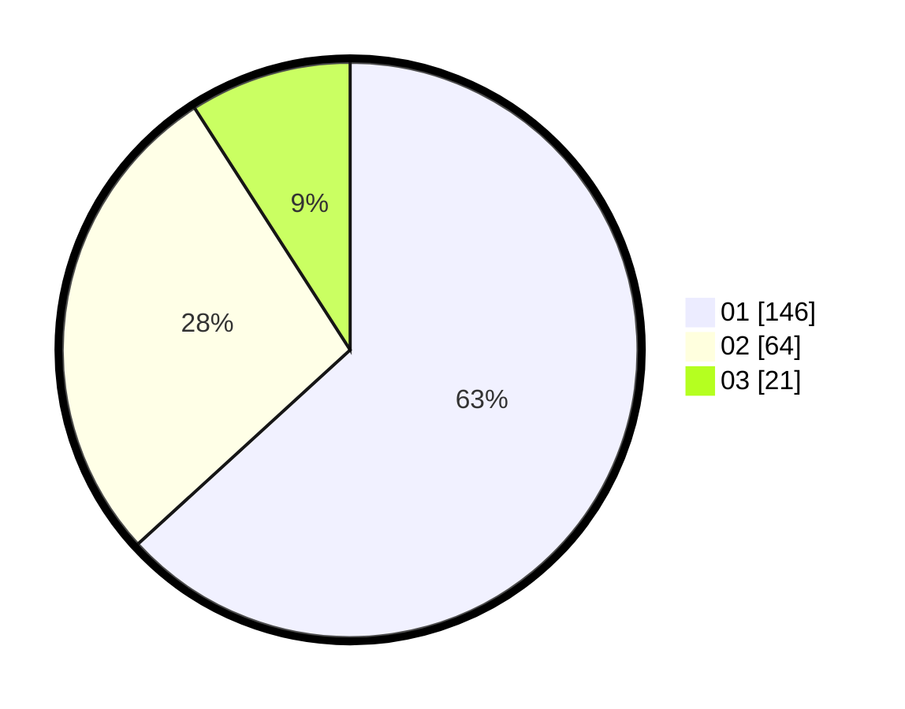

# Hasil

Hasil perolehan suara paslon dapat dilihat pada file paslon-01.txt, paslon-02.txt, dan paslon-03.txt.

Jika tidak ada, artinya data tersebut belum ada pada SIREKAP.

## Perolehan Suara

 * Paslon 01: **146**.
 * Paslon 02: **64**.
 * Paslon 03: **21**.

## Foto C Plano

https://sirekap-obj-formc.kpu.go.id/64fb/pemilu/ppwp/31/73/07/10/02/3173071002013-20240214-155859--ef84fc94-3d3c-48a9-8016-9fdcdce0fd84.jpg

https://sirekap-obj-formc.kpu.go.id/64fb/pemilu/ppwp/31/73/07/10/02/3173071002013-20240214-155600--8e15564a-3069-46c4-ba19-803e8fb800aa.jpg

https://sirekap-obj-formc.kpu.go.id/64fb/pemilu/ppwp/31/73/07/10/02/3173071002013-20240214-155623--4452e115-4545-4dc7-adac-6ee5cd8f7450.jpg

## DATA PEMILIH TETAP

Jumlah pemilih dalam DPT: **265**.
 * L: **135**.
 * P: **130**.

## DATA PENGGUNA HAK PILIH

Jumlah pengguna hak pilih dalam DPT: **228**.
 * L: **117**.
 * P: **111**.

Jumlah pengguna hak pilih dalam DPTb: **10**.
 * L: **5**.
 * P: **5**.

Jumlah pengguna hak pilih dalam DPK: **0**.
 * L: **0**.
 * P: **0**.

Jumlah pengguna hak pilih: **238**.
 * L: **122**.
 * P: **116**.

## JUMLAH SUARA SAH DAN TIDAK SAH

JUMLAH SELURUH SUARA SAH: **231**.

JUMLAH SUARA TIDAK SAH: **7**.

JUMLAH SELURUH SUARA SAH DAN SUARA TIDAK SAH: **238**.
