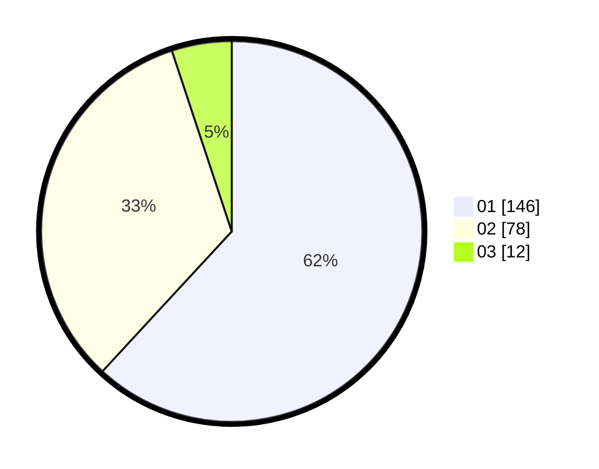

# Hasil

Hasil perolehan suara paslon dapat dilihat pada file paslon-01.txt, paslon-02.txt, dan paslon-03.txt.

Jika tidak ada, artinya data tersebut belum ada pada SIREKAP.

## Perolehan Suara

 * Paslon 01: **146**.
 * Paslon 02: **78**.
 * Paslon 03: **12**.

## Foto C Plano

https://sirekap-obj-formc.kpu.go.id/6a6c/pemilu/ppwp/31/73/07/10/02/3173071002021-20240214-193636--44c79392-4a81-4e51-8c9b-572af0cb5022.jpg

https://sirekap-obj-formc.kpu.go.id/6a6c/pemilu/ppwp/31/73/07/10/02/3173071002021-20240214-193642--de14d888-3d19-4806-b8dd-74d226c8eb3b.jpg

https://sirekap-obj-formc.kpu.go.id/6a6c/pemilu/ppwp/31/73/07/10/02/3173071002021-20240214-193643--cc5ad2d3-ec92-4364-90bc-a193f44e5124.jpg
