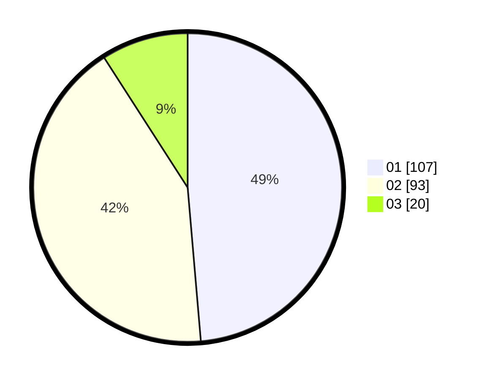

# Hasil

Hasil perolehan suara paslon dapat dilihat pada file paslon-01.txt, paslon-02.txt, dan paslon-03.txt.

Jika tidak ada, artinya data tersebut belum ada pada SIREKAP.

## Perolehan Suara

 * Paslon 01: **107**.
 * Paslon 02: **93**.
 * Paslon 03: **20**.

## Foto C Plano

https://sirekap-obj-formc.kpu.go.id/2c65/pemilu/ppwp/31/73/07/10/02/3173071002022-20240216-140659--629f52b0-452c-403e-adfa-a9f4ae83bc3f.jpg

https://sirekap-obj-formc.kpu.go.id/2c65/pemilu/ppwp/31/73/07/10/02/3173071002022-20240216-140700--a4d50552-e5d2-4406-a920-3e0bce017d72.jpg

https://sirekap-obj-formc.kpu.go.id/2c65/pemilu/ppwp/31/73/07/10/02/3173071002022-20240216-140700--ae87ecb6-b3e1-4c12-ad3b-11e198a0dac5.jpg

## DATA PEMILIH TETAP

Jumlah pemilih dalam DPT: **259**.
 * L: **136**.
 * P: **123**.

## DATA PENGGUNA HAK PILIH

Jumlah pengguna hak pilih dalam DPT: **205**.
 * L: **105**.
 * P: **100**.

Jumlah pengguna hak pilih dalam DPTb: **13**.
 * L: **2**.
 * P: **11**.

Jumlah pengguna hak pilih dalam DPK: **3**.
 * L: **0**.
 * P: **3**.

Jumlah pengguna hak pilih: **221**.
 * L: **107**.
 * P: **114**.

## JUMLAH SUARA SAH DAN TIDAK SAH

JUMLAH SELURUH SUARA SAH: **220**.

JUMLAH SUARA TIDAK SAH: **1**.

JUMLAH SELURUH SUARA SAH DAN SUARA TIDAK SAH: **221**.
