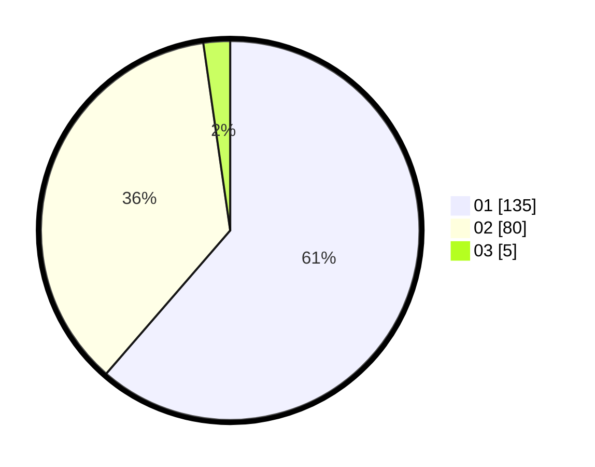

# Hasil

Hasil perolehan suara paslon dapat dilihat pada file paslon-01.txt, paslon-02.txt, dan paslon-03.txt.

Jika tidak ada, artinya data tersebut belum ada pada SIREKAP.

## Perolehan Suara

 * Paslon 01: **135**.
 * Paslon 02: **80**.
 * Paslon 03: **5**.

## Foto C Plano

https://sirekap-obj-formc.kpu.go.id/5d09/pemilu/ppwp/31/73/07/10/02/3173071002030-20240216-040859--ee2eb2c1-2588-4a67-91e5-570cd13d7c52.jpg

https://sirekap-obj-formc.kpu.go.id/5d09/pemilu/ppwp/31/73/07/10/02/3173071002030-20240216-040915--4d953d54-4a6c-461f-a18a-2d0ea18eb7f9.jpg

https://sirekap-obj-formc.kpu.go.id/5d09/pemilu/ppwp/31/73/07/10/02/3173071002030-20240216-041723--f86730e3-5a8c-48e9-a42c-c6065f4fd1d4.jpg

## DATA PEMILIH TETAP

Jumlah pemilih dalam DPT: **262**.
 * L: **133**.
 * P: **129**.

## DATA PENGGUNA HAK PILIH

Jumlah pengguna hak pilih dalam DPT: **206**.
 * L: **102**.
 * P: **104**.

Jumlah pengguna hak pilih dalam DPTb: **10**.
 * L: **6**.
 * P: **4**.

Jumlah pengguna hak pilih dalam DPK: **5**.
 * L: **3**.
 * P: **2**.

Jumlah pengguna hak pilih: **221**.
 * L: **111**.
 * P: **110**.

## JUMLAH SUARA SAH DAN TIDAK SAH

JUMLAH SELURUH SUARA SAH: **220**.

JUMLAH SUARA TIDAK SAH: **1**.

JUMLAH SELURUH SUARA SAH DAN SUARA TIDAK SAH: **221**.
