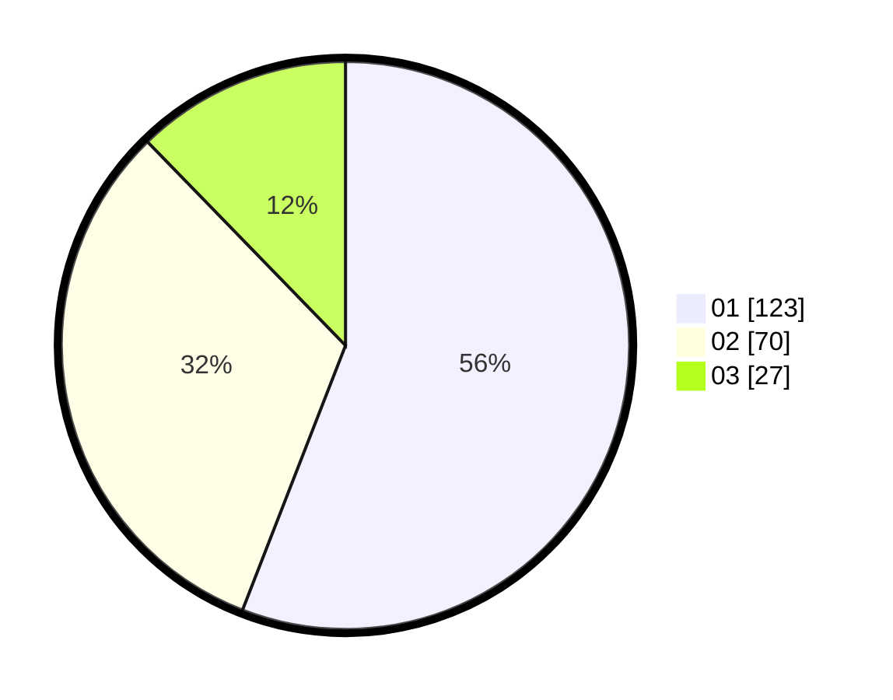

# Hasil

Hasil perolehan suara paslon dapat dilihat pada file paslon-01.txt, paslon-02.txt, dan paslon-03.txt.

Jika tidak ada, artinya data tersebut belum ada pada SIREKAP.

## Perolehan Suara

 * Paslon 01: **123**.
 * Paslon 02: **70**.
 * Paslon 03: **27**.

## Foto C Plano

https://sirekap-obj-formc.kpu.go.id/3e47/pemilu/ppwp/31/73/07/10/02/3173071002032-20240214-155820--b3fe6768-f301-4c22-bf7b-4b05cbd411f2.jpg

https://sirekap-obj-formc.kpu.go.id/3e47/pemilu/ppwp/31/73/07/10/02/3173071002032-20240216-063733--2b789438-8a18-4212-9bc3-7a4250190252.jpg

https://sirekap-obj-formc.kpu.go.id/3e47/pemilu/ppwp/31/73/07/10/02/3173071002032-20240216-063730--feabff89-2d17-4653-9773-5a705bb5c341.jpg

## DATA PEMILIH TETAP

Jumlah pemilih dalam DPT: **252**.
 * L: **129**.
 * P: **123**.

## DATA PENGGUNA HAK PILIH

Jumlah pengguna hak pilih dalam DPT: **212**.
 * L: **104**.
 * P: **108**.

Jumlah pengguna hak pilih dalam DPTb: **6**.
 * L: **2**.
 * P: **4**.

Jumlah pengguna hak pilih dalam DPK: **5**.
 * L: **2**.
 * P: **3**.

Jumlah pengguna hak pilih: **223**.
 * L: **108**.
 * P: **115**.

## JUMLAH SUARA SAH DAN TIDAK SAH

JUMLAH SELURUH SUARA SAH: **220**.

JUMLAH SUARA TIDAK SAH: **3**.

JUMLAH SELURUH SUARA SAH DAN SUARA TIDAK SAH: **223**.
