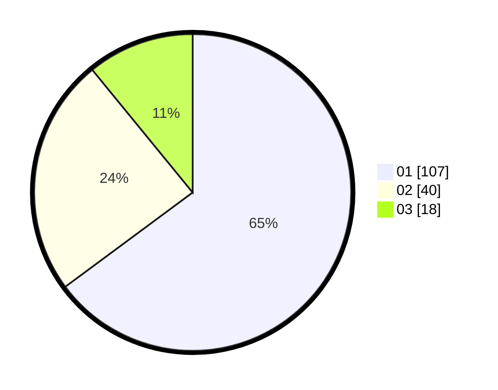

# Hasil

Hasil perolehan suara paslon dapat dilihat pada file paslon-01.txt, paslon-02.txt, dan paslon-03.txt.

Jika tidak ada, artinya data tersebut belum ada pada SIREKAP.

## Perolehan Suara

 * Paslon 01: **107**.
 * Paslon 02: **40**.
 * Paslon 03: **18**.

## Foto C Plano

https://sirekap-obj-formc.kpu.go.id/00c0/pemilu/ppwp/31/73/07/10/02/3173071002035-20240216-150522--d54820f2-75f9-4c58-9aae-40e54fc90786.jpg

https://sirekap-obj-formc.kpu.go.id/00c0/pemilu/ppwp/31/73/07/10/02/3173071002035-20240216-150524--a051df65-390e-4604-87a9-3bcf31516351.jpg

https://sirekap-obj-formc.kpu.go.id/00c0/pemilu/ppwp/31/73/07/10/02/3173071002035-20240216-150523--aaa04bfb-410f-4c92-9e3c-b8044be25875.jpg

## DATA PEMILIH TETAP

Jumlah pemilih dalam DPT: **0**.
 * L: **0**.
 * P: **0**.

## DATA PENGGUNA HAK PILIH

Jumlah pengguna hak pilih dalam DPT: **0**.
 * L: **0**.
 * P: **0**.

Jumlah pengguna hak pilih dalam DPTb: **0**.
 * L: **0**.
 * P: **0**.

Jumlah pengguna hak pilih dalam DPK: **0**.
 * L: **0**.
 * P: **0**.

Jumlah pengguna hak pilih: **0**.
 * L: **0**.
 * P: **0**.

## JUMLAH SUARA SAH DAN TIDAK SAH

JUMLAH SELURUH SUARA SAH: **165**.

JUMLAH SUARA TIDAK SAH: **1**.

JUMLAH SELURUH SUARA SAH DAN SUARA TIDAK SAH: **166**.
