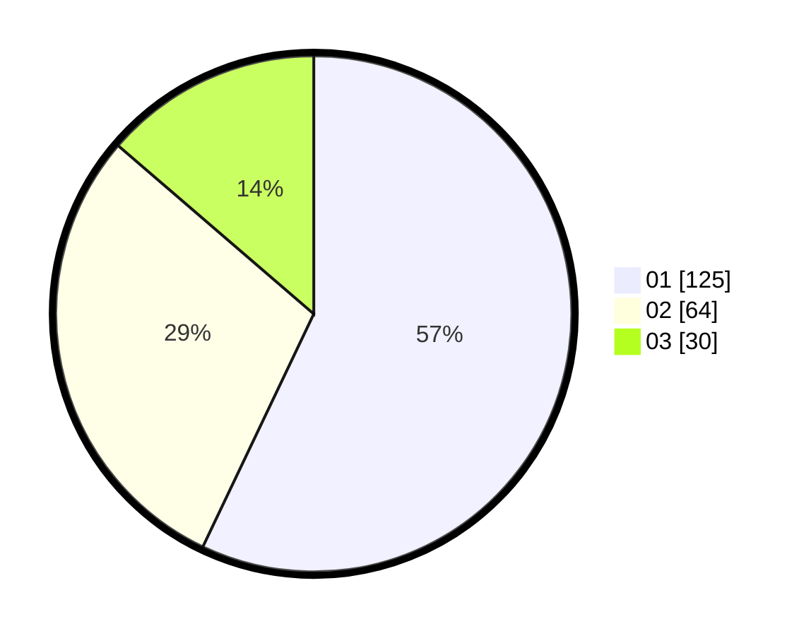

# Hasil

Hasil perolehan suara paslon dapat dilihat pada file paslon-01.txt, paslon-02.txt, dan paslon-03.txt.

Jika tidak ada, artinya data tersebut belum ada pada SIREKAP.

## Perolehan Suara

 * Paslon 01: **125**.
 * Paslon 02: **64**.
 * Paslon 03: **30**.

## Foto C Plano

https://sirekap-obj-formc.kpu.go.id/ea19/pemilu/ppwp/31/73/07/10/02/3173071002040-20240216-052622--90950060-4c13-49d2-b7ae-62352990a578.jpg

https://sirekap-obj-formc.kpu.go.id/ea19/pemilu/ppwp/31/73/07/10/02/3173071002040-20240216-052632--ef1ae7d0-b60d-43ea-9b2d-423c25555164.jpg

https://sirekap-obj-formc.kpu.go.id/ea19/pemilu/ppwp/31/73/07/10/02/3173071002040-20240216-052627--419b2be9-9e01-4f4d-a289-3ad05b80bcc8.jpg

## DATA PEMILIH TETAP

Jumlah pemilih dalam DPT: **266**.
 * L: **134**.
 * P: **132**.

## DATA PENGGUNA HAK PILIH

Jumlah pengguna hak pilih dalam DPT: **213**.
 * L: **106**.
 * P: **107**.

Jumlah pengguna hak pilih dalam DPTb: **7**.
 * L: **2**.
 * P: **5**.

Jumlah pengguna hak pilih dalam DPK: **0**.
 * L: **0**.
 * P: **0**.

Jumlah pengguna hak pilih: **220**.
 * L: **108**.
 * P: **112**.

## JUMLAH SUARA SAH DAN TIDAK SAH

JUMLAH SELURUH SUARA SAH: **219**.

JUMLAH SUARA TIDAK SAH: **1**.

JUMLAH SELURUH SUARA SAH DAN SUARA TIDAK SAH: **220**.
