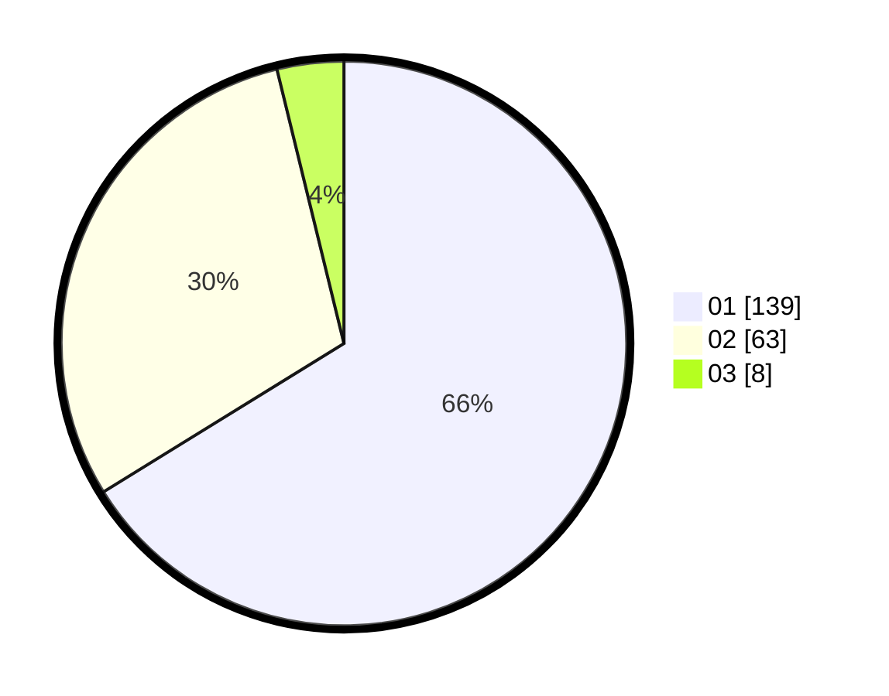

# Hasil

Hasil perolehan suara paslon dapat dilihat pada file paslon-01.txt, paslon-02.txt, dan paslon-03.txt.

Jika tidak ada, artinya data tersebut belum ada pada SIREKAP.

## Perolehan Suara

 * Paslon 01: **139**.
 * Paslon 02: **63**.
 * Paslon 03: **8**.

## Foto C Plano

https://sirekap-obj-formc.kpu.go.id/a064/pemilu/ppwp/31/73/07/10/02/3173071002044-20240215-161712--fab06374-3e22-4459-bbe8-e2acb659d7ec.jpg

https://sirekap-obj-formc.kpu.go.id/a064/pemilu/ppwp/31/73/07/10/02/3173071002044-20240215-161718--1315dca3-0316-4043-a1ee-5d23b708a567.jpg

https://sirekap-obj-formc.kpu.go.id/a064/pemilu/ppwp/31/73/07/10/02/3173071002044-20240215-161726--bd0e6685-6f8d-4203-adef-a9b5a529129e.jpg
