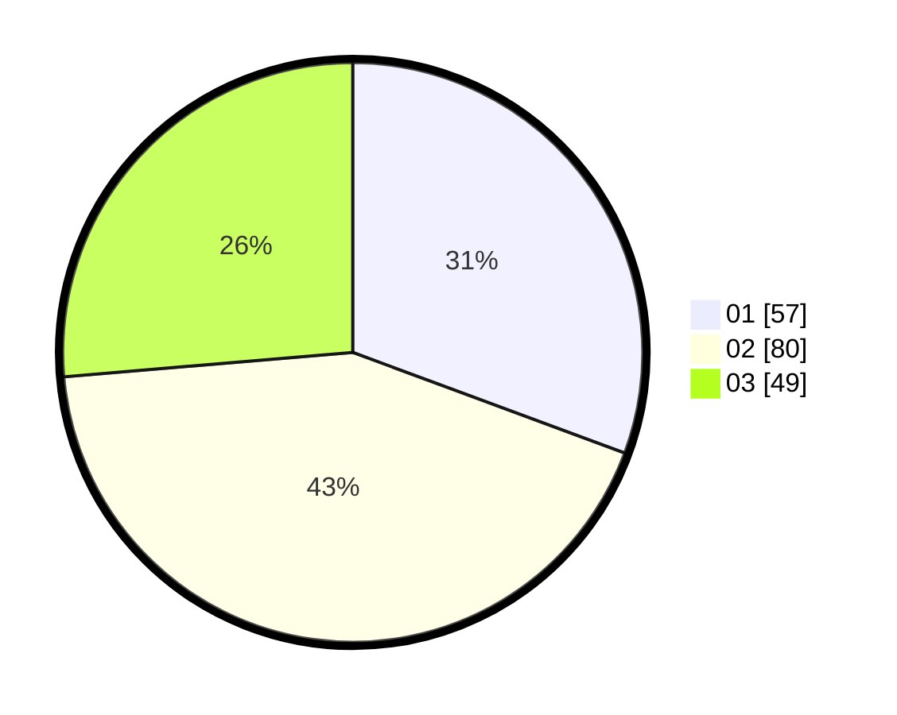

# Hasil

Hasil perolehan suara paslon dapat dilihat pada file paslon-01.txt, paslon-02.txt, dan paslon-03.txt.

Jika tidak ada, artinya data tersebut belum ada pada SIREKAP.

## Perolehan Suara

 * Paslon 01: **57**.
 * Paslon 02: **80**.
 * Paslon 03: **49**.

## Foto C Plano

https://sirekap-obj-formc.kpu.go.id/0b68/pemilu/ppwp/31/73/07/10/02/3173071002050-20240214-225453--ff30c0df-1c9b-46e1-b338-fd6cf6d26d3e.jpg

https://sirekap-obj-formc.kpu.go.id/0b68/pemilu/ppwp/31/73/07/10/02/3173071002050-20240214-225603--9571a86e-a78b-4c85-816e-70a36c99f2f1.jpg

https://sirekap-obj-formc.kpu.go.id/0b68/pemilu/ppwp/31/73/07/10/02/3173071002050-20240214-225701--403df667-75ae-454d-a13e-60d305cd1f5c.jpg
