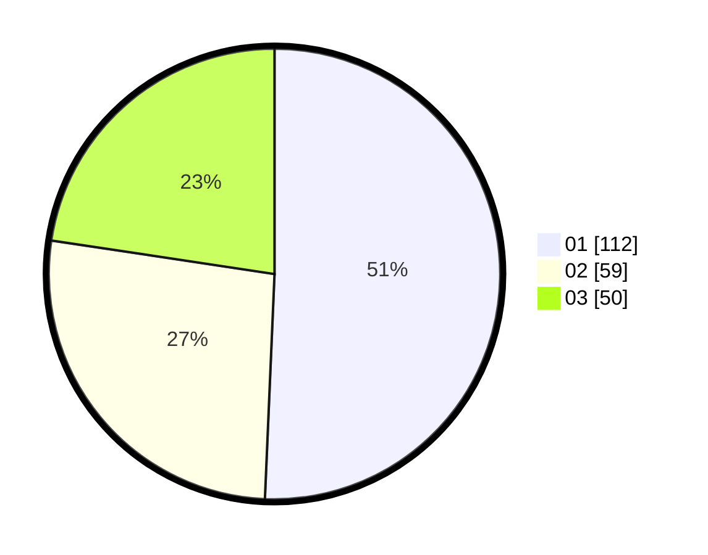

# Hasil

Hasil perolehan suara paslon dapat dilihat pada file paslon-01.txt, paslon-02.txt, dan paslon-03.txt.

Jika tidak ada, artinya data tersebut belum ada pada SIREKAP.

## Perolehan Suara

 * Paslon 01: **112**.
 * Paslon 02: **59**.
 * Paslon 03: **50**.

## Foto C Plano

https://sirekap-obj-formc.kpu.go.id/0d4f/pemilu/ppwp/31/73/07/10/02/3173071002052-20240216-002739--8b30f18e-fd4d-4a8b-ab19-23721e14a2f8.jpg

https://sirekap-obj-formc.kpu.go.id/0d4f/pemilu/ppwp/31/73/07/10/02/3173071002052-20240216-002742--5d570674-21b3-4535-81e7-c669681fcf57.jpg

https://sirekap-obj-formc.kpu.go.id/0d4f/pemilu/ppwp/31/73/07/10/02/3173071002052-20240216-002741--91b5fa25-6ae5-4cf1-861b-3d924327a503.jpg

## DATA PEMILIH TETAP

Jumlah pemilih dalam DPT: **278**.
 * L: **130**.
 * P: **148**.

## DATA PENGGUNA HAK PILIH

Jumlah pengguna hak pilih dalam DPT: **207**.
 * L: **97**.
 * P: **110**.

Jumlah pengguna hak pilih dalam DPTb: **11**.
 * L: **9**.
 * P: **2**.

Jumlah pengguna hak pilih dalam DPK: **3**.
 * L: **3**.
 * P: **0**.

Jumlah pengguna hak pilih: **221**.
 * L: **109**.
 * P: **112**.

## JUMLAH SUARA SAH DAN TIDAK SAH

JUMLAH SELURUH SUARA SAH: **221**.

JUMLAH SUARA TIDAK SAH: **0**.

JUMLAH SELURUH SUARA SAH DAN SUARA TIDAK SAH: **221**.
