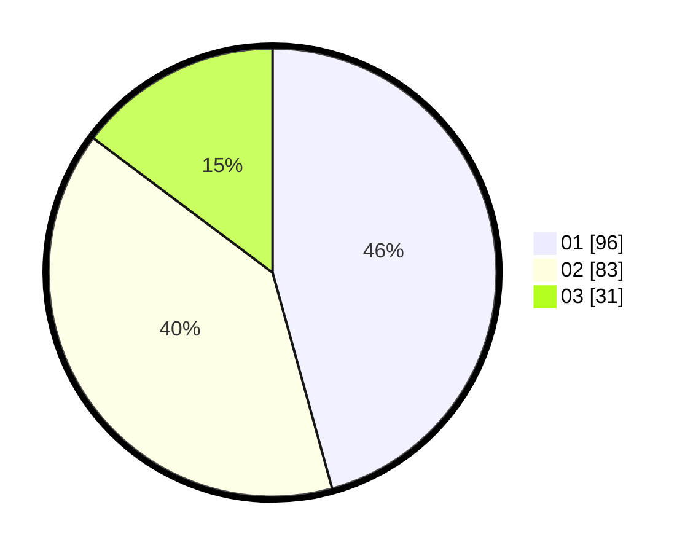

# Hasil

Hasil perolehan suara paslon dapat dilihat pada file paslon-01.txt, paslon-02.txt, dan paslon-03.txt.

Jika tidak ada, artinya data tersebut belum ada pada SIREKAP.

## Perolehan Suara

 * Paslon 01: **96**.
 * Paslon 02: **83**.
 * Paslon 03: **31**.

## Foto C Plano

https://sirekap-obj-formc.kpu.go.id/72ea/pemilu/ppwp/31/73/07/10/02/3173071002055-20240216-120917--af250f3a-a51c-4bb8-9155-024b6fdb2897.jpg

https://sirekap-obj-formc.kpu.go.id/72ea/pemilu/ppwp/31/73/07/10/02/3173071002055-20240216-120925--51664929-9a86-49d5-884e-501ac7824380.jpg

https://sirekap-obj-formc.kpu.go.id/72ea/pemilu/ppwp/31/73/07/10/02/3173071002055-20240216-120920--a7187abd-46ca-471a-896e-e8c1f09d4fe6.jpg

## DATA PEMILIH TETAP

Jumlah pemilih dalam DPT: **243**.
 * L: **124**.
 * P: **119**.

## DATA PENGGUNA HAK PILIH

Jumlah pengguna hak pilih dalam DPT: **206**.
 * L: **99**.
 * P: **107**.

Jumlah pengguna hak pilih dalam DPTb: **5**.
 * L: **0**.
 * P: **5**.

Jumlah pengguna hak pilih dalam DPK: **0**.
 * L: **0**.
 * P: **0**.

Jumlah pengguna hak pilih: **211**.
 * L: **99**.
 * P: **112**.

## JUMLAH SUARA SAH DAN TIDAK SAH

JUMLAH SELURUH SUARA SAH: **210**.

JUMLAH SUARA TIDAK SAH: **1**.

JUMLAH SELURUH SUARA SAH DAN SUARA TIDAK SAH: **211**.
