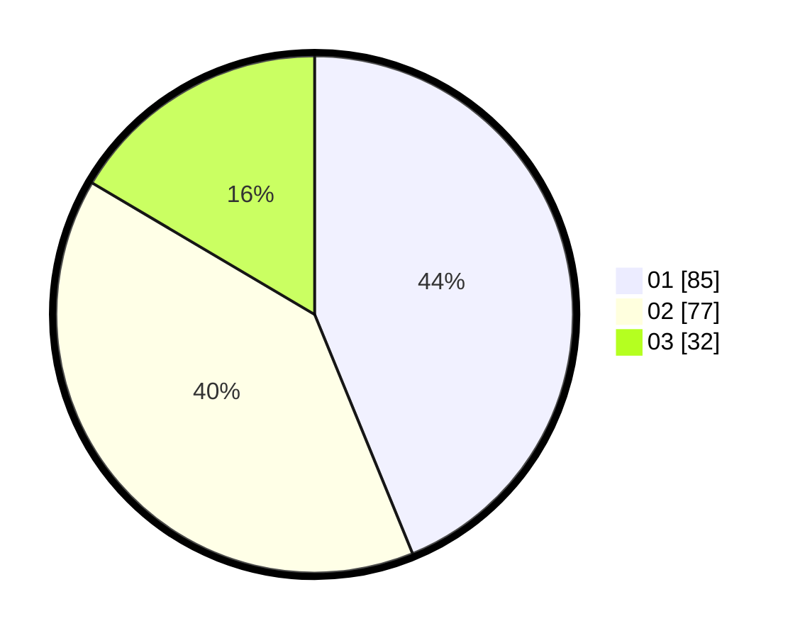

# Hasil

Hasil perolehan suara paslon dapat dilihat pada file paslon-01.txt, paslon-02.txt, dan paslon-03.txt.

Jika tidak ada, artinya data tersebut belum ada pada SIREKAP.

## Perolehan Suara

 * Paslon 01: **85**.
 * Paslon 02: **77**.
 * Paslon 03: **32**.

## Foto C Plano

https://sirekap-obj-formc.kpu.go.id/2c5a/pemilu/ppwp/31/73/07/10/02/3173071002059-20240216-074029--088a45bd-c833-4f98-bae9-4ef0330275dc.jpg

https://sirekap-obj-formc.kpu.go.id/2c5a/pemilu/ppwp/31/73/07/10/02/3173071002059-20240216-074041--cc858621-1747-49b1-bbde-e6871a5808aa.jpg

https://sirekap-obj-formc.kpu.go.id/2c5a/pemilu/ppwp/31/73/07/10/02/3173071002059-20240216-074037--c8b9393f-f84a-4a9e-9831-ea0383f90fca.jpg

## DATA PEMILIH TETAP

Jumlah pemilih dalam DPT: **249**.
 * L: **130**.
 * P: **119**.

## DATA PENGGUNA HAK PILIH

Jumlah pengguna hak pilih dalam DPT: **187**.
 * L: **98**.
 * P: **89**.

Jumlah pengguna hak pilih dalam DPTb: **7**.
 * L: **3**.
 * P: **4**.

Jumlah pengguna hak pilih dalam DPK: **2**.
 * L: **1**.
 * P: **1**.

Jumlah pengguna hak pilih: **196**.
 * L: **102**.
 * P: **94**.

## JUMLAH SUARA SAH DAN TIDAK SAH

JUMLAH SELURUH SUARA SAH: **194**.

JUMLAH SUARA TIDAK SAH: **2**.

JUMLAH SELURUH SUARA SAH DAN SUARA TIDAK SAH: **196**.
