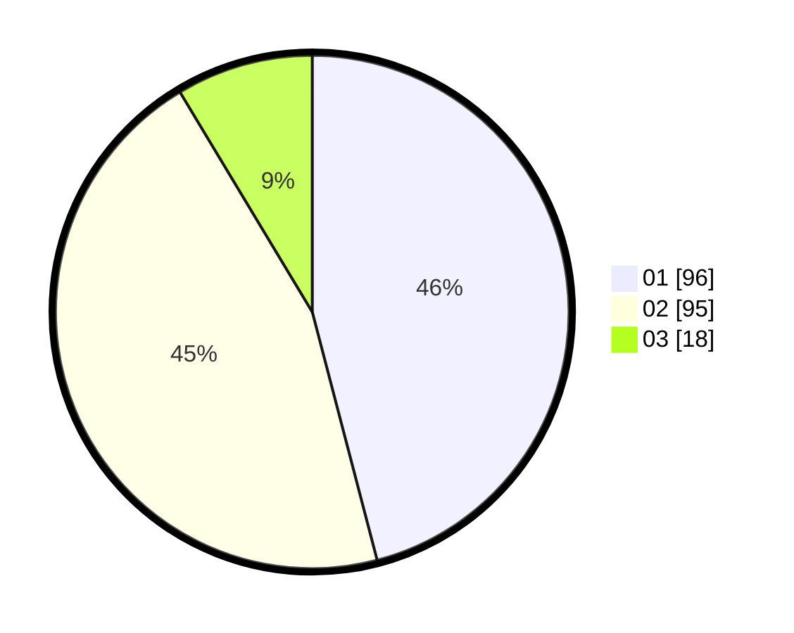

# Hasil

Hasil perolehan suara paslon dapat dilihat pada file paslon-01.txt, paslon-02.txt, dan paslon-03.txt.

Jika tidak ada, artinya data tersebut belum ada pada SIREKAP.

## Perolehan Suara

 * Paslon 01: **96**.
 * Paslon 02: **95**.
 * Paslon 03: **18**.

## Foto C Plano

https://sirekap-obj-formc.kpu.go.id/0eea/pemilu/ppwp/31/73/07/10/03/3173071003001-20240214-214310--71cc52b9-ddf2-430f-847a-1a60d84792a8.jpg

https://sirekap-obj-formc.kpu.go.id/0eea/pemilu/ppwp/31/73/07/10/03/3173071003001-20240214-214625--27faf496-82fe-4d8f-8f04-1b4667763613.jpg

https://sirekap-obj-formc.kpu.go.id/0eea/pemilu/ppwp/31/73/07/10/03/3173071003001-20240214-214814--5ea572c0-06a2-4b1e-8f7a-ac512d19d1ca.jpg
