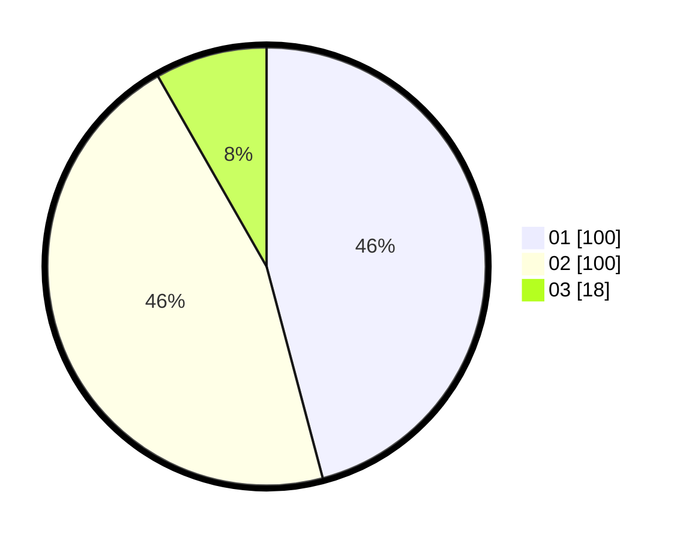

# Hasil

Hasil perolehan suara paslon dapat dilihat pada file paslon-01.txt, paslon-02.txt, dan paslon-03.txt.

Jika tidak ada, artinya data tersebut belum ada pada SIREKAP.

## Perolehan Suara

 * Paslon 01: **100**.
 * Paslon 02: **100**.
 * Paslon 03: **18**.

## Foto C Plano

https://sirekap-obj-formc.kpu.go.id/d667/pemilu/ppwp/31/73/07/10/03/3173071003002-20240215-000310--388c6196-098f-4225-9222-6e6d8ad5d6e9.jpg

https://sirekap-obj-formc.kpu.go.id/d667/pemilu/ppwp/31/73/07/10/03/3173071003002-20240215-000506--c0d130ca-356a-4036-b650-fd541885c3bf.jpg

https://sirekap-obj-formc.kpu.go.id/d667/pemilu/ppwp/31/73/07/10/03/3173071003002-20240215-000623--e5f337e3-d622-4af9-a3e3-767d13c77c57.jpg
