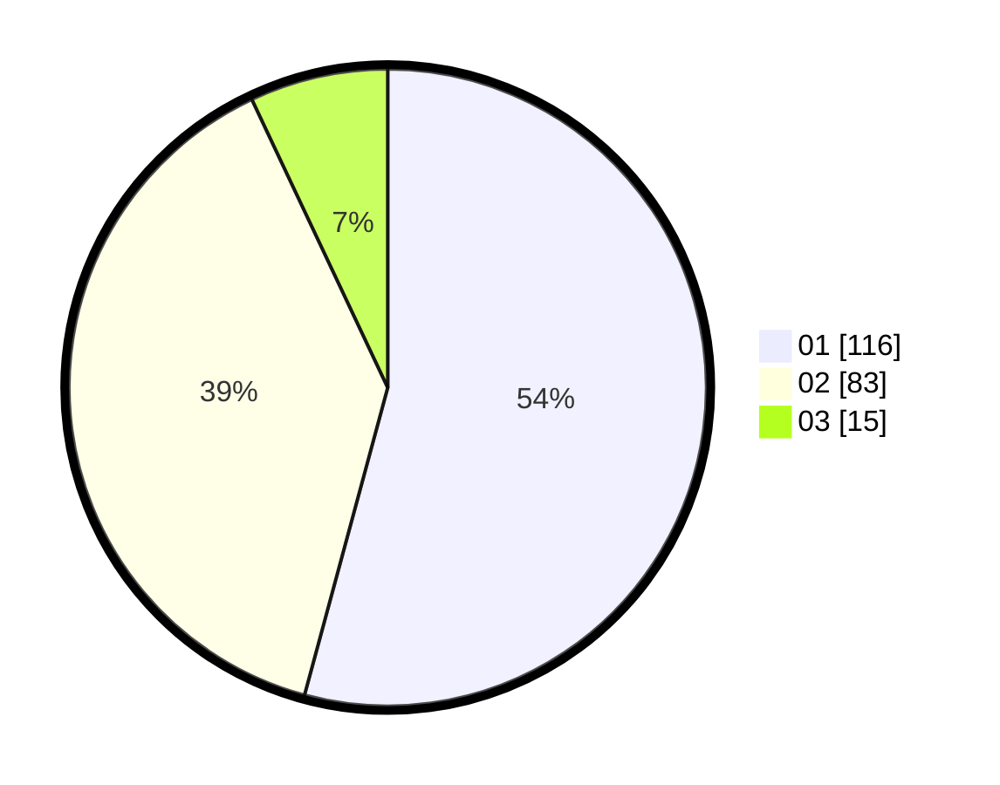

# Hasil

Hasil perolehan suara paslon dapat dilihat pada file paslon-01.txt, paslon-02.txt, dan paslon-03.txt.

Jika tidak ada, artinya data tersebut belum ada pada SIREKAP.

## Perolehan Suara

 * Paslon 01: **116**.
 * Paslon 02: **83**.
 * Paslon 03: **15**.

## Foto C Plano

https://sirekap-obj-formc.kpu.go.id/b47f/pemilu/ppwp/31/73/07/10/03/3173071003006-20240214-234318--a2ed2dab-fefe-4866-827e-3b352caadb15.jpg

https://sirekap-obj-formc.kpu.go.id/b47f/pemilu/ppwp/31/73/07/10/03/3173071003006-20240214-234415--113175e7-de43-481f-8daf-47a5bce68c3f.jpg

https://sirekap-obj-formc.kpu.go.id/b47f/pemilu/ppwp/31/73/07/10/03/3173071003006-20240214-234520--218d0a2a-67cc-4721-ac26-495b3fc48ae8.jpg

## DATA PEMILIH TETAP

Jumlah pemilih dalam DPT: **276**.
 * L: **134**.
 * P: **142**.

## DATA PENGGUNA HAK PILIH

Jumlah pengguna hak pilih dalam DPT: **216**.
 * L: **101**.
 * P: **115**.

Jumlah pengguna hak pilih dalam DPTb: **0**.
 * L: **0**.
 * P: **0**.

Jumlah pengguna hak pilih dalam DPK: **0**.
 * L: **0**.
 * P: **0**.

Jumlah pengguna hak pilih: **216**.
 * L: **101**.
 * P: **115**.

## JUMLAH SUARA SAH DAN TIDAK SAH

JUMLAH SELURUH SUARA SAH: **214**.

JUMLAH SUARA TIDAK SAH: **2**.

JUMLAH SELURUH SUARA SAH DAN SUARA TIDAK SAH: **216**.
