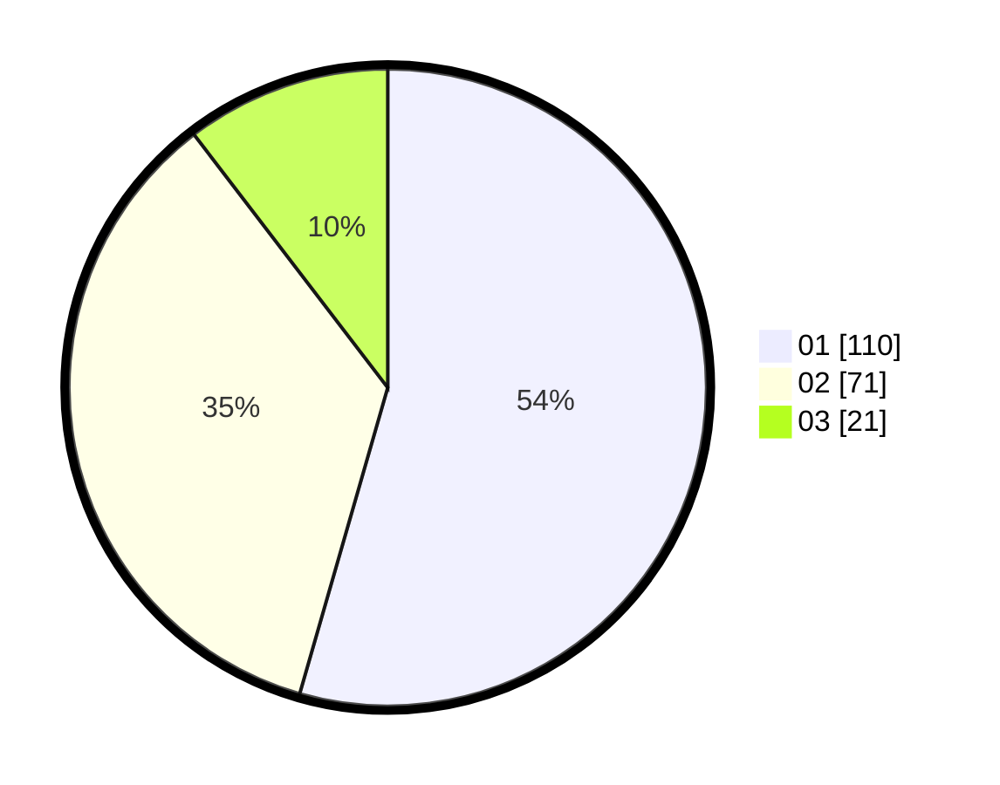

# Hasil

Hasil perolehan suara paslon dapat dilihat pada file paslon-01.txt, paslon-02.txt, dan paslon-03.txt.

Jika tidak ada, artinya data tersebut belum ada pada SIREKAP.

## Perolehan Suara

 * Paslon 01: **110**.
 * Paslon 02: **71**.
 * Paslon 03: **21**.

## Foto C Plano

https://sirekap-obj-formc.kpu.go.id/de1f/pemilu/ppwp/31/73/07/10/03/3173071003009-20240215-004240--786ec464-2c08-42bf-9e97-86581420f4e4.jpg

https://sirekap-obj-formc.kpu.go.id/de1f/pemilu/ppwp/31/73/07/10/03/3173071003009-20240215-004423--288c50b7-c0e3-4986-a109-f6464f656f8e.jpg

https://sirekap-obj-formc.kpu.go.id/de1f/pemilu/ppwp/31/73/07/10/03/3173071003009-20240215-004637--74ea836b-cb8a-43f6-8fc5-2732338b4de7.jpg
