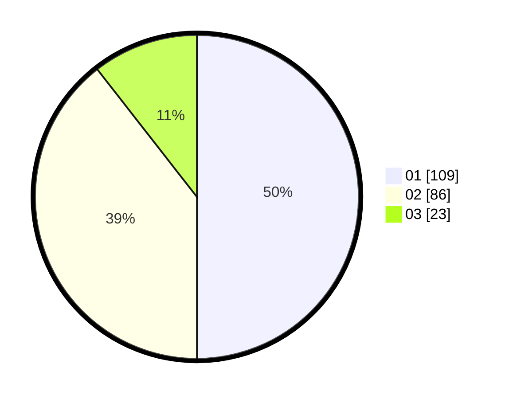

# Hasil

Hasil perolehan suara paslon dapat dilihat pada file paslon-01.txt, paslon-02.txt, dan paslon-03.txt.

Jika tidak ada, artinya data tersebut belum ada pada SIREKAP.

## Perolehan Suara

 * Paslon 01: **109**.
 * Paslon 02: **86**.
 * Paslon 03: **23**.

## Foto C Plano

https://sirekap-obj-formc.kpu.go.id/610e/pemilu/ppwp/31/73/07/10/03/3173071003011-20240215-021014--da548668-7048-45ae-a784-9d06af632eba.jpg

https://sirekap-obj-formc.kpu.go.id/610e/pemilu/ppwp/31/73/07/10/03/3173071003011-20240215-021047--e12eb3d1-9169-435e-827f-6f78ae50e5ce.jpg

https://sirekap-obj-formc.kpu.go.id/610e/pemilu/ppwp/31/73/07/10/03/3173071003011-20240215-021108--03b378d1-15b4-42ac-840d-ddb81c13ffb5.jpg
