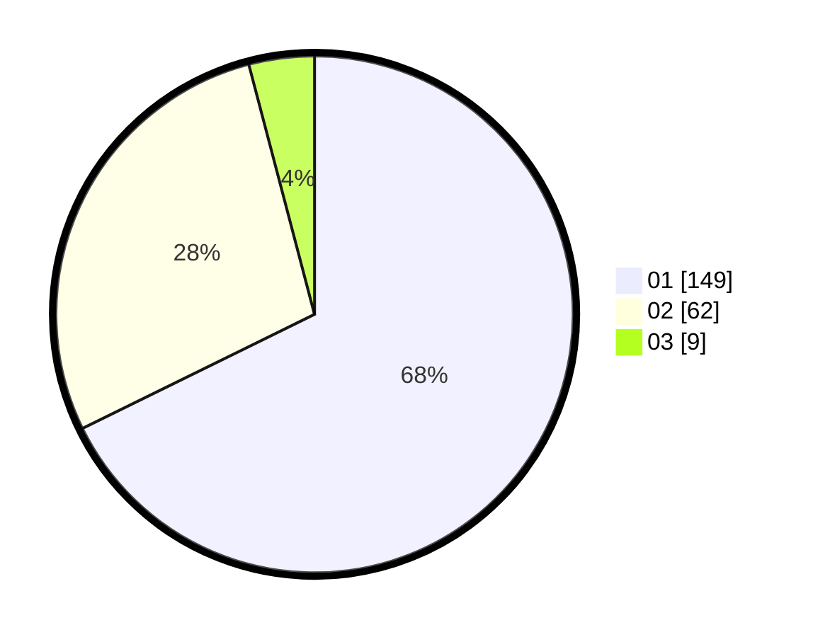

# Hasil

Hasil perolehan suara paslon dapat dilihat pada file paslon-01.txt, paslon-02.txt, dan paslon-03.txt.

Jika tidak ada, artinya data tersebut belum ada pada SIREKAP.

## Perolehan Suara

 * Paslon 01: **149**.
 * Paslon 02: **62**.
 * Paslon 03: **9**.

## Foto C Plano

https://sirekap-obj-formc.kpu.go.id/a434/pemilu/ppwp/31/73/07/10/03/3173071003016-20240214-200119--12d3ddb8-b49e-47d5-94e9-961c6cd876de.jpg

https://sirekap-obj-formc.kpu.go.id/a434/pemilu/ppwp/31/73/07/10/03/3173071003016-20240214-222730--f945811c-66cf-465b-9003-bb883b8dd18c.jpg

https://sirekap-obj-formc.kpu.go.id/a434/pemilu/ppwp/31/73/07/10/03/3173071003016-20240214-223911--b58f9314-430c-4b00-9901-e22c54ccdb52.jpg

## DATA PEMILIH TETAP

Jumlah pemilih dalam DPT: **255**.
 * L: **124**.
 * P: **131**.

## DATA PENGGUNA HAK PILIH

Jumlah pengguna hak pilih dalam DPT: **215**.
 * L: **99**.
 * P: **116**.

Jumlah pengguna hak pilih dalam DPTb: **6**.
 * L: **3**.
 * P: **3**.

Jumlah pengguna hak pilih dalam DPK: **2**.
 * L: **1**.
 * P: **1**.

Jumlah pengguna hak pilih: **223**.
 * L: **103**.
 * P: **120**.

## JUMLAH SUARA SAH DAN TIDAK SAH

JUMLAH SELURUH SUARA SAH: **220**.

JUMLAH SUARA TIDAK SAH: **3**.

JUMLAH SELURUH SUARA SAH DAN SUARA TIDAK SAH: **223**.
