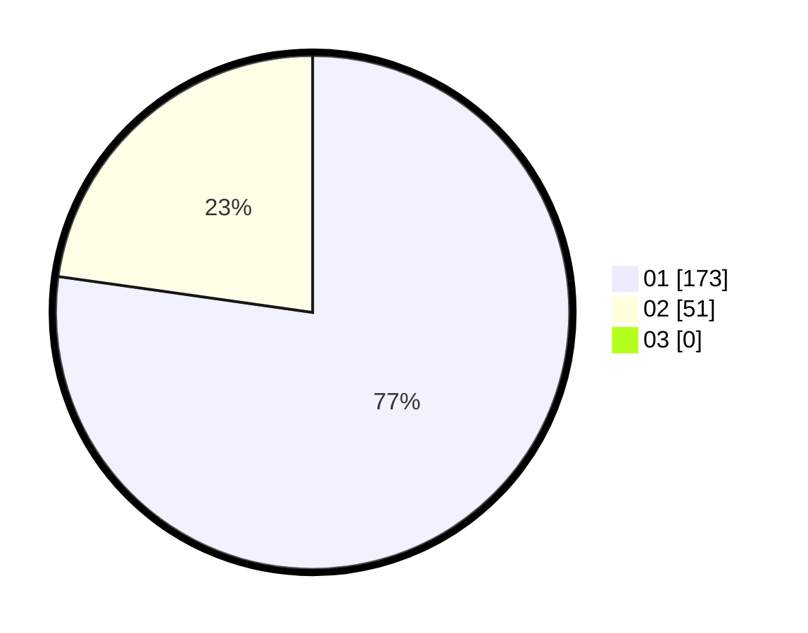

# Hasil

Hasil perolehan suara paslon dapat dilihat pada file paslon-01.txt, paslon-02.txt, dan paslon-03.txt.

Jika tidak ada, artinya data tersebut belum ada pada SIREKAP.

## Perolehan Suara

 * Paslon 01: **173**.
 * Paslon 02: **51**.
 * Paslon 03: **0**.

## Foto C Plano

https://sirekap-obj-formc.kpu.go.id/c631/pemilu/ppwp/31/73/07/10/03/3173071003019-20240215-005831--a5fef8a7-5eb8-467a-81e2-849aa8e05f1f.jpg

https://sirekap-obj-formc.kpu.go.id/c631/pemilu/ppwp/31/73/07/10/03/3173071003019-20240215-005919--bf95edb3-6555-49c2-973d-ab1732c76632.jpg

https://sirekap-obj-formc.kpu.go.id/c631/pemilu/ppwp/31/73/07/10/03/3173071003019-20240215-005951--db4fe3d4-f86a-49fb-a37d-43d36b9e4bab.jpg
