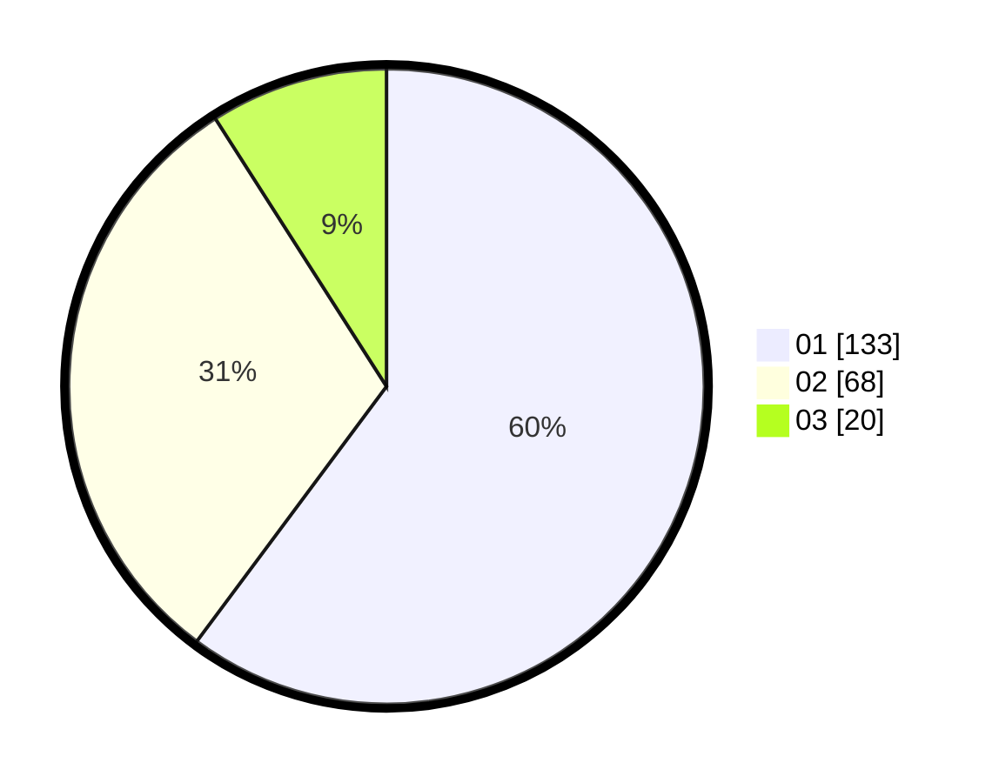

# Hasil

Hasil perolehan suara paslon dapat dilihat pada file paslon-01.txt, paslon-02.txt, dan paslon-03.txt.

Jika tidak ada, artinya data tersebut belum ada pada SIREKAP.

## Perolehan Suara

 * Paslon 01: **133**.
 * Paslon 02: **68**.
 * Paslon 03: **20**.

## Foto C Plano

https://sirekap-obj-formc.kpu.go.id/2999/pemilu/ppwp/31/73/07/10/03/3173071003020-20240214-230408--b2c6ae10-b6f1-447f-9680-2d4fbb50a7d6.jpg

https://sirekap-obj-formc.kpu.go.id/2999/pemilu/ppwp/31/73/07/10/03/3173071003020-20240214-230454--013c820e-0fa7-4828-b51a-8d49fd868fbb.jpg

https://sirekap-obj-formc.kpu.go.id/2999/pemilu/ppwp/31/73/07/10/03/3173071003020-20240214-230549--d1380312-c7c4-4ed7-b9ed-3181118cf766.jpg

## DATA PEMILIH TETAP

Jumlah pemilih dalam DPT: **272**.
 * L: **133**.
 * P: **139**.

## DATA PENGGUNA HAK PILIH

Jumlah pengguna hak pilih dalam DPT: **219**.
 * L: **102**.
 * P: **117**.

Jumlah pengguna hak pilih dalam DPTb: **6**.
 * L: **3**.
 * P: **3**.

Jumlah pengguna hak pilih dalam DPK: **0**.
 * L: **0**.
 * P: **0**.

Jumlah pengguna hak pilih: **225**.
 * L: **105**.
 * P: **120**.

## JUMLAH SUARA SAH DAN TIDAK SAH

JUMLAH SELURUH SUARA SAH: **221**.

JUMLAH SUARA TIDAK SAH: **4**.

JUMLAH SELURUH SUARA SAH DAN SUARA TIDAK SAH: **225**.
