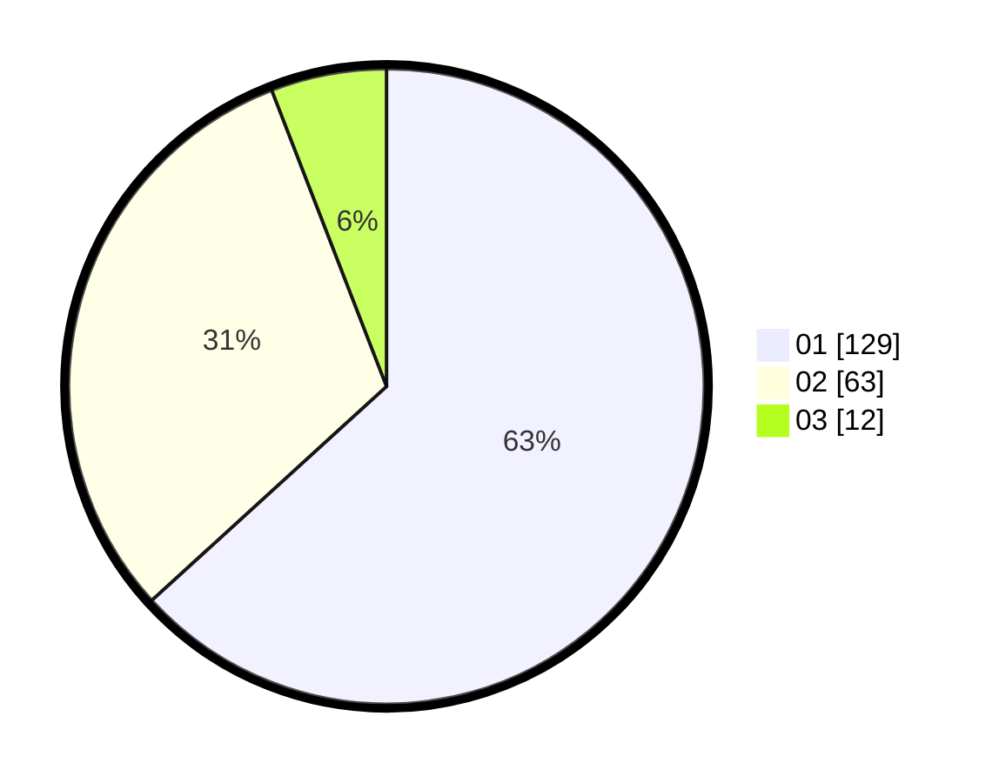

# Hasil

Hasil perolehan suara paslon dapat dilihat pada file paslon-01.txt, paslon-02.txt, dan paslon-03.txt.

Jika tidak ada, artinya data tersebut belum ada pada SIREKAP.

## Perolehan Suara

 * Paslon 01: **129**.
 * Paslon 02: **63**.
 * Paslon 03: **12**.

## Foto C Plano

https://sirekap-obj-formc.kpu.go.id/7004/pemilu/ppwp/31/73/07/10/03/3173071003022-20240214-210918--00872bfb-0dfc-4a5b-8349-0cd791078676.jpg

https://sirekap-obj-formc.kpu.go.id/7004/pemilu/ppwp/31/73/07/10/03/3173071003022-20240214-210937--fd21d4fd-4690-43de-b2ae-d80fb906fb98.jpg

https://sirekap-obj-formc.kpu.go.id/7004/pemilu/ppwp/31/73/07/10/03/3173071003022-20240214-210955--4be54a27-22af-453e-927e-e4467af0c7c5.jpg

## DATA PEMILIH TETAP

Jumlah pemilih dalam DPT: **274**.
 * L: **138**.
 * P: **136**.

## DATA PENGGUNA HAK PILIH

Jumlah pengguna hak pilih dalam DPT: **206**.
 * L: **97**.
 * P: **109**.

Jumlah pengguna hak pilih dalam DPTb: **1**.
 * L: **0**.
 * P: **1**.

Jumlah pengguna hak pilih dalam DPK: **0**.
 * L: **0**.
 * P: **0**.

Jumlah pengguna hak pilih: **207**.
 * L: **97**.
 * P: **110**.

## JUMLAH SUARA SAH DAN TIDAK SAH

JUMLAH SELURUH SUARA SAH: **204**.

JUMLAH SUARA TIDAK SAH: **3**.

JUMLAH SELURUH SUARA SAH DAN SUARA TIDAK SAH: **207**.
