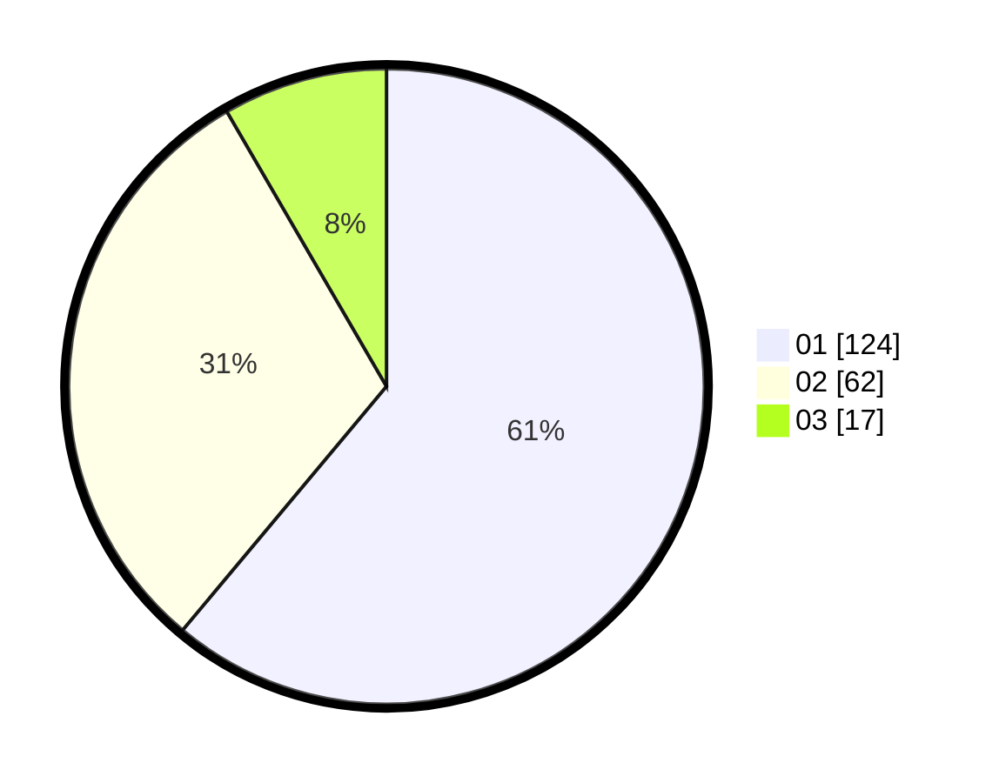

# Hasil

Hasil perolehan suara paslon dapat dilihat pada file paslon-01.txt, paslon-02.txt, dan paslon-03.txt.

Jika tidak ada, artinya data tersebut belum ada pada SIREKAP.

## Perolehan Suara

 * Paslon 01: **124**.
 * Paslon 02: **62**.
 * Paslon 03: **17**.

## Foto C Plano

https://sirekap-obj-formc.kpu.go.id/e2ac/pemilu/ppwp/31/73/07/10/03/3173071003023-20240214-211607--b076fad1-da80-4889-b29e-381f09d53bcf.jpg

https://sirekap-obj-formc.kpu.go.id/e2ac/pemilu/ppwp/31/73/07/10/03/3173071003023-20240214-213537--56195e31-4bce-4152-96b3-beaba2bafe8d.jpg

https://sirekap-obj-formc.kpu.go.id/e2ac/pemilu/ppwp/31/73/07/10/03/3173071003023-20240214-213205--28ae93d3-8e00-433a-97e3-b8bfe13c6e26.jpg
