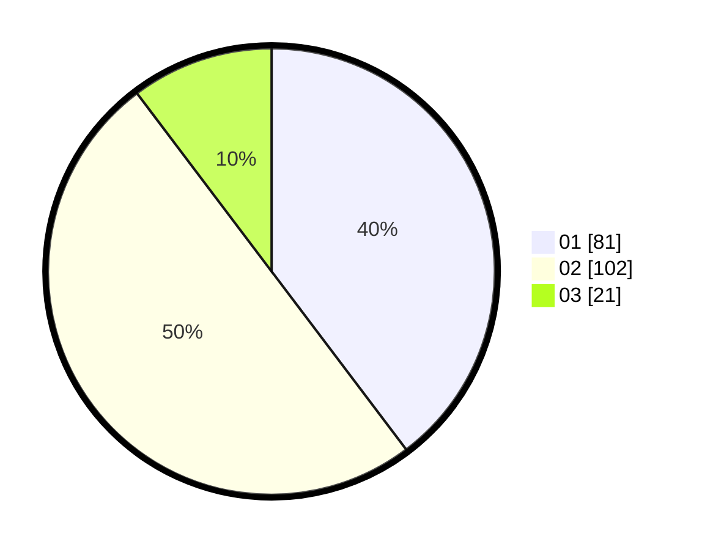

# Hasil

Hasil perolehan suara paslon dapat dilihat pada file paslon-01.txt, paslon-02.txt, dan paslon-03.txt.

Jika tidak ada, artinya data tersebut belum ada pada SIREKAP.

## Perolehan Suara

 * Paslon 01: **81**.
 * Paslon 02: **102**.
 * Paslon 03: **21**.

## Foto C Plano

https://sirekap-obj-formc.kpu.go.id/cbe5/pemilu/ppwp/31/73/07/10/03/3173071003026-20240214-222826--d010c057-6835-49c9-ac77-ca8d1c7ba1a4.jpg

https://sirekap-obj-formc.kpu.go.id/cbe5/pemilu/ppwp/31/73/07/10/03/3173071003026-20240214-223029--d162db2c-d9a1-4a45-a28a-e06d7e23459d.jpg

https://sirekap-obj-formc.kpu.go.id/cbe5/pemilu/ppwp/31/73/07/10/03/3173071003026-20240214-223230--b40e85d1-3a71-4dcb-aeae-774481009433.jpg
