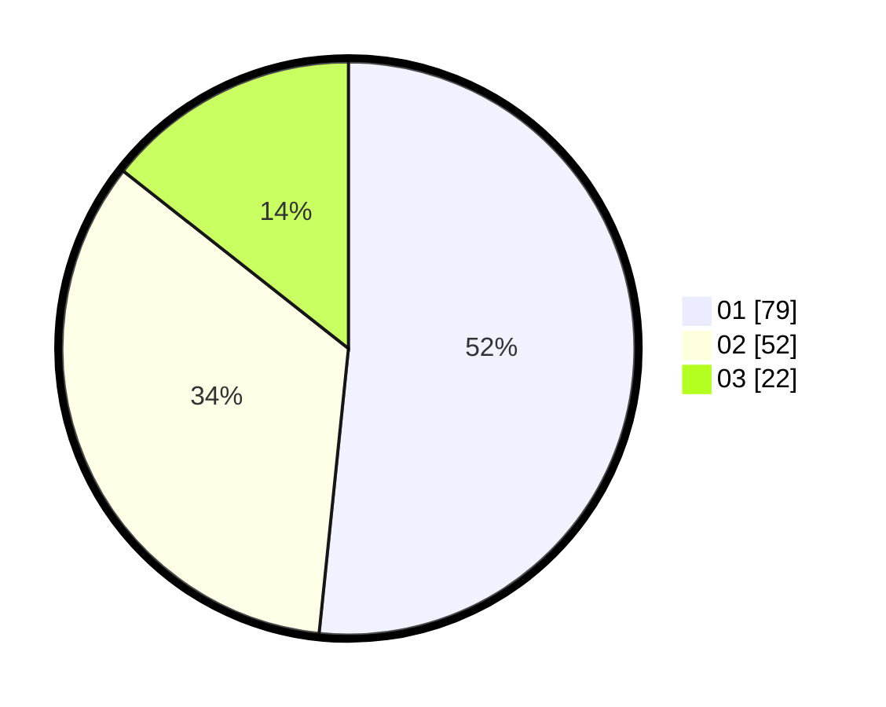

# Hasil

Hasil perolehan suara paslon dapat dilihat pada file paslon-01.txt, paslon-02.txt, dan paslon-03.txt.

Jika tidak ada, artinya data tersebut belum ada pada SIREKAP.

## Perolehan Suara

 * Paslon 01: **79**.
 * Paslon 02: **52**.
 * Paslon 03: **22**.

## Foto C Plano

https://sirekap-obj-formc.kpu.go.id/e7eb/pemilu/ppwp/31/73/07/10/03/3173071003029-20240215-000214--6be20f1e-10bb-4acc-92d1-08e8817e4e6d.jpg

https://sirekap-obj-formc.kpu.go.id/e7eb/pemilu/ppwp/31/73/07/10/03/3173071003029-20240215-000257--d68b9fdc-20ac-4681-a93c-a6b4b4ccd107.jpg

https://sirekap-obj-formc.kpu.go.id/e7eb/pemilu/ppwp/31/73/07/10/03/3173071003029-20240215-000335--83294620-8094-4054-8c1f-64e36e07d135.jpg
