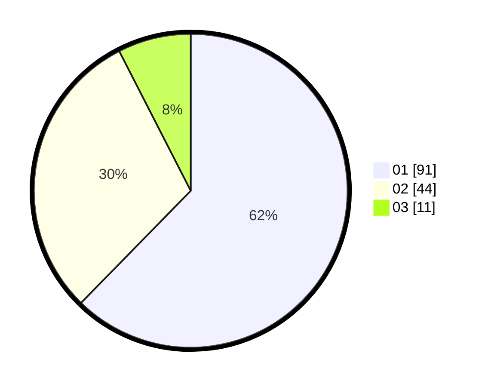

# Hasil

Hasil perolehan suara paslon dapat dilihat pada file paslon-01.txt, paslon-02.txt, dan paslon-03.txt.

Jika tidak ada, artinya data tersebut belum ada pada SIREKAP.

## Perolehan Suara

 * Paslon 01: **91**.
 * Paslon 02: **44**.
 * Paslon 03: **11**.

## Foto C Plano

https://sirekap-obj-formc.kpu.go.id/5ff9/pemilu/ppwp/31/73/07/10/03/3173071003030-20240214-234312--32eb4bd7-629e-4991-a2f5-ba9fe097f4ed.jpg

https://sirekap-obj-formc.kpu.go.id/5ff9/pemilu/ppwp/31/73/07/10/03/3173071003030-20240214-234422--e335be26-e53c-4203-8c28-545edb53815d.jpg

https://sirekap-obj-formc.kpu.go.id/5ff9/pemilu/ppwp/31/73/07/10/03/3173071003030-20240214-231525--2d34acb6-ad04-4791-9eab-f8487b0ad881.jpg
