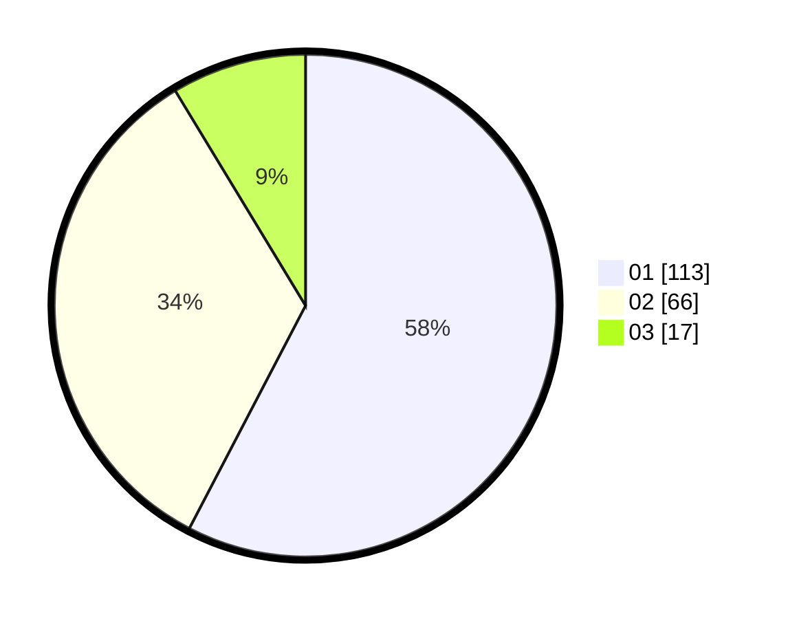

# Hasil

Hasil perolehan suara paslon dapat dilihat pada file paslon-01.txt, paslon-02.txt, dan paslon-03.txt.

Jika tidak ada, artinya data tersebut belum ada pada SIREKAP.

## Perolehan Suara

 * Paslon 01: **113**.
 * Paslon 02: **66**.
 * Paslon 03: **17**.

## Foto C Plano

https://sirekap-obj-formc.kpu.go.id/e0d0/pemilu/ppwp/31/73/07/10/03/3173071003032-20240214-220851--9331ee21-8b0a-4bfb-8b7a-ba7567c8b4aa.jpg

https://sirekap-obj-formc.kpu.go.id/e0d0/pemilu/ppwp/31/73/07/10/03/3173071003032-20240215-215633--388901ee-c9bf-4fbb-a5fe-0f0468569efa.jpg

https://sirekap-obj-formc.kpu.go.id/e0d0/pemilu/ppwp/31/73/07/10/03/3173071003032-20240215-215843--c2353697-0764-4c36-a32e-dff94fe5e0c0.jpg

## DATA PEMILIH TETAP

Jumlah pemilih dalam DPT: **269**.
 * L: **132**.
 * P: **137**.

## DATA PENGGUNA HAK PILIH

Jumlah pengguna hak pilih dalam DPT: **198**.
 * L: **90**.
 * P: **108**.

Jumlah pengguna hak pilih dalam DPTb: **1**.
 * L: **0**.
 * P: **1**.

Jumlah pengguna hak pilih dalam DPK: **1**.
 * L: **1**.
 * P: **0**.

Jumlah pengguna hak pilih: **200**.
 * L: **91**.
 * P: **109**.

## JUMLAH SUARA SAH DAN TIDAK SAH

JUMLAH SELURUH SUARA SAH: **196**.

JUMLAH SUARA TIDAK SAH: **4**.

JUMLAH SELURUH SUARA SAH DAN SUARA TIDAK SAH: **200**.
